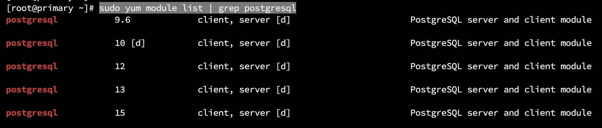

# How to Set up PostgreSQL Database Replication

##  Setup Physical PostgreSQL Replication on RHEL 8

Install terlebih dahulu pada VM Box OS RHEL 8 pada kedua node (Primary dan Standby)
- Primary Node : 192.168.1.25
- Standby Node : 192.168.1.26

### Step 1 : Install PostgreSQL Server

```bash
yum update
```

```bash
reboot
```

```bash
sudo yum module list | grep postgresql
```
```bash
sudo yum install @postgresql:15
```

```bash
sudo systemctl status postgresql
```
Command diatas akan menghasilkan output informasi bahwa service dalam keadaan up dan running.
Jika dalam suatu kondisi statusnya tidak running maka perlu di start terlebih dahulu.

```bash
sudo systemctl enable postgresql
```

### Step 2 : Configure Primary Node

Masuk ke psql

```bash
sudo -u postgres psql
```

Lalu selanjutnya kita perlu membuat user replication dari sisi primary node.

```bash
CREATE ROLE replica_user WITH REPLICATION LOGIN PASSWORD 'adminpass';
```

Lalu, logout dari psql.

```bash
\q
```

Selanjutnya kita perlu konfigurasi file postgresql.conf

```bash
sudo vim /etc/postgresql/14/main/postgresql.conf
```

```bash
listen_addresses = '192.168.1.23'

wal_level = logical

wal_log_hints = on
```

Selanjutnya kita perlu untuk menambahkan konfigurasi pada pg_hba.conf pada baris terbawah dan terakhir

```bash
sudo vim /etc/postgresql/14/main/pg_hba.conf
```
```bash
host  replication   replica_user  192.168.1.24/24   md5
```

Lalu selanjutnya hanya perlu di restart service nya.

```bash
sudo systemctl restart postgresql
```


### Step 3 : Configure Standby Node 

Sebelum node standby dapat mulai mereplikasi data dari simpul utama, kita perlu membuat salinan direktori data simpul utama ke direktori data replika. Untuk mencapai hal ini, pertama-tama, hentikan layanan PostgreSQL pada node replika.

```bash
sudo systemctl stop postgresql
```

Selanjutnya hapus semua file pada replica user untuk memulai dalam kondisi clean dan membuat ruang berdasarkan dari sisi primary node data direktori.

```bash
sudo rm -rv /var/lib/postgresql/14/main/
```

Selanjutnya kita perlu jalankan command pg_basebackup untuk copy data dari primary ke standby.

```bash
sudo pg_basebackup -h 192.168.1.23 -U replica_user -X stream -C -S replica_1 -v -R -W -D /var/lib/postgresql/14/main/
```

Tidak lupa, setelah berhasil menjalankan command diatas kita perlu grant ownership dari data directory postgre user.

```bash
sudo chown postgres -R /var/lib/postgresql/14/main/
```

Sekarang kita bisa start PostgreSQL server pada Standby.

```bash
sudo systemctl start postgresql
```

### Step 4 : Test The Replication Setup

Pada sisi Primary, kita masuk ke psql

```bash
sudo -u postgres psql
```

Dan jalankan query dibawah ini :

```bash
SELECT client_addr, state
FROM pg_stat_replication;
```

### Study Cases Sederhana

Kita buat database baru, lalu coba select dari sisi primary dan standby.

```bash
CREATE DATABASE students_db;
```

```bash
\l
```

```bash
\c students_db
```

```bash
CREATE TABLE student_details (first_name VARCHAR(15), last_name VARCHAR(15) , email VARCHAR(40) );
```

```bash
INSERT INTO  student_details (first_name, last_name, email)
VALUES  ('Emil', 'Salim', 'salimemil842@gmail.com');
```

```bash
SELECT *
FROM student_details;
```

Dan tidak lupa coba cek dari sisi standby

```bash
SELECT *
FROM student_details;
```
