# How to Restart PostgreSQL

Untuk melakukan shutdown dan restart pada primary dan replica dalam konteks PostgreSQL, kita dapat mengikuti langkah-langkah berikut:

## Shutdown

ALUR SHUTDOWN DIMULAI DARI REPLICA -> PRIMARY

Pada server replica, kita dapat menjalankan perintah pg_ctl atau systemctl (tergantung pada sistem operasi kita) untuk menghentikan layanan PostgreSQL:

Cek GAP terlebih dahulu:

Masuk ke psql dengan command
```bash
sudo -u postgres psql
```

Pada Standby
```bash
SELECT * FROM pg_stat_replication;
```
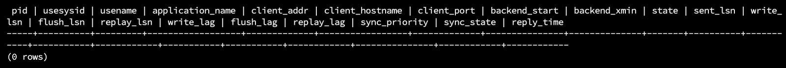

Pada Primary
Cek Streaming berjalan dengan baik
```bash
SELECT client_addr, state
FROM pg_stat_replication;
```
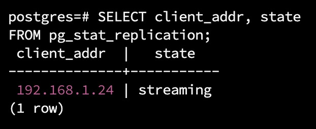

```bash
SELECT pg_current_wal_lsn();
```
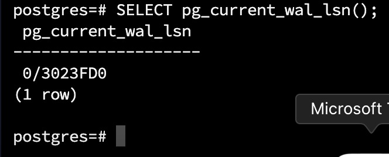

Lalu mulai stop service dari STANDBY -> PRIMARY :

STANDBY :
```bash
systemctl status postgresql
```
```bash
date
```
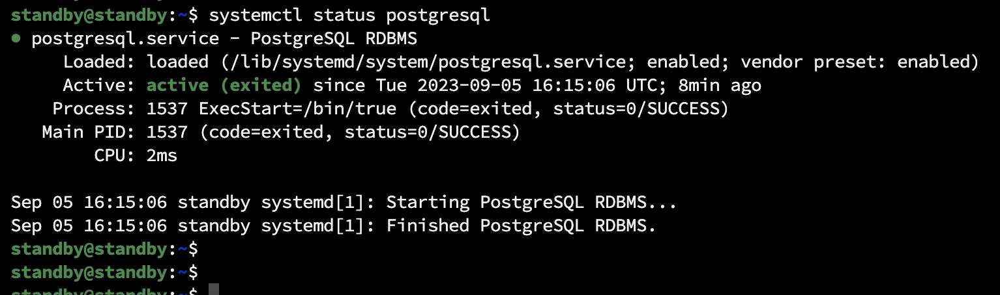

```bash
systemctl stop postgresql
```
```bash
systemctl status postgresql
```
```bash
date
```


PRIMARY:
```bash
systemctl status postgresql
```
```bash
date
```
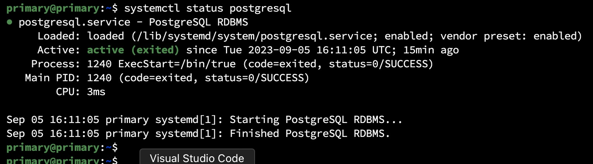

```bash
systemctl stop postgresql
```
```bash
systemctl status postgresql
```
```bash
date
```
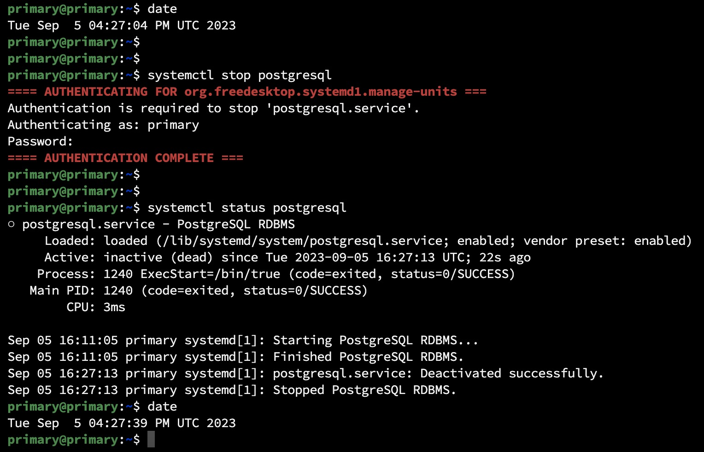

## Restart

ALUR RESTART DIMULAI DARI PRIMARY -> REPLICA

Lalu start service:

Mulai start PRIMARY
```bash
systemctl status postgresql
```
```bash
date
```


```bash
systemctl start postgresql
```
```bash
systemctl status postgresql
```
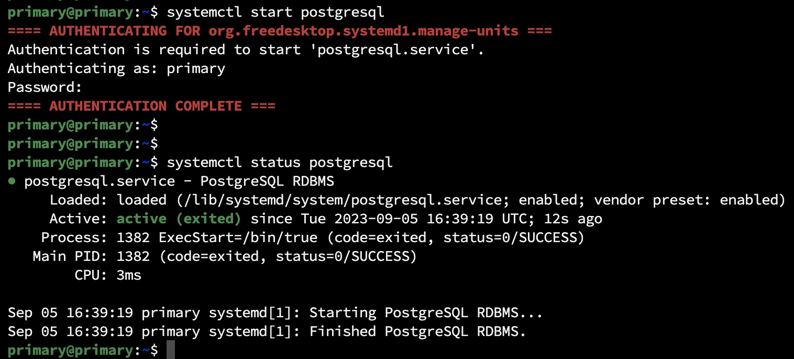

Mulai Start STANDBY
```bash
systemctl status postgresql
```
```bash
date
```
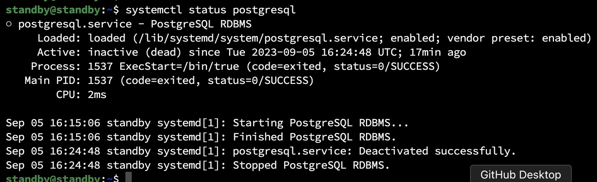

```bash
systemctl start postgresql
```
```bash
systemctl status postgresql
```
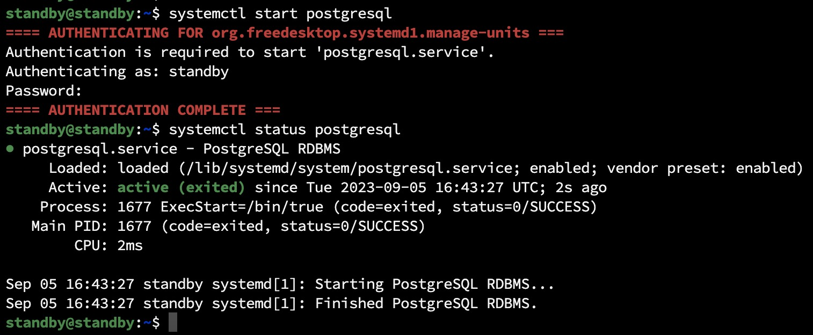


Cek GAP terlebih kembali:
```bash
sudo -u postgres psql
```

Pada Standby
```bash
SELECT * FROM pg_stat_replication;
```
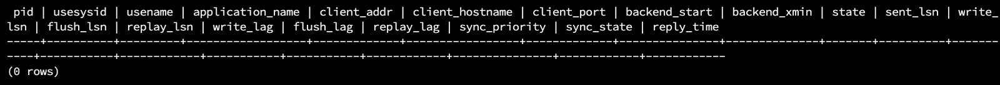
```bash
select * from pg_stat_wal_receiver;
```
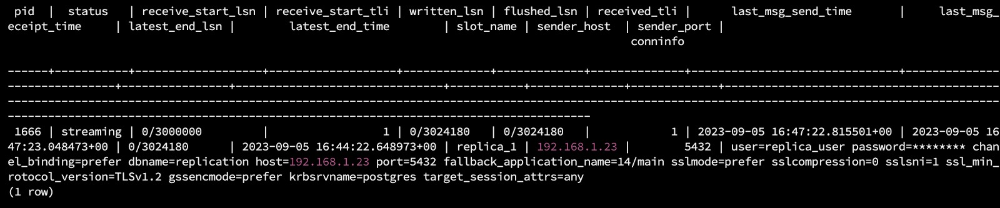

Pada Primary
```bash
SELECT pg_current_wal_lsn();
```
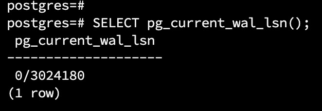
```bash
select * from pg_stat_replication;
```
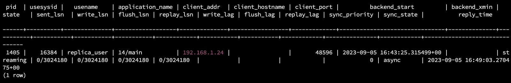

Cek Streaming berjalan dengan baik pada primary
```bash
SELECT client_addr, state
FROM pg_stat_replication;
```
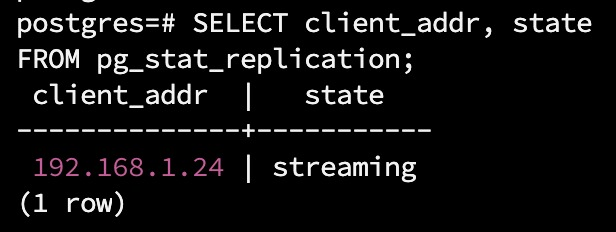