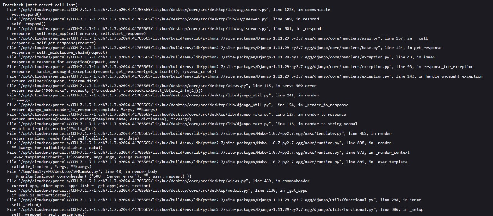
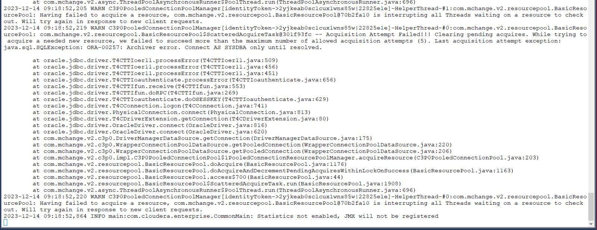
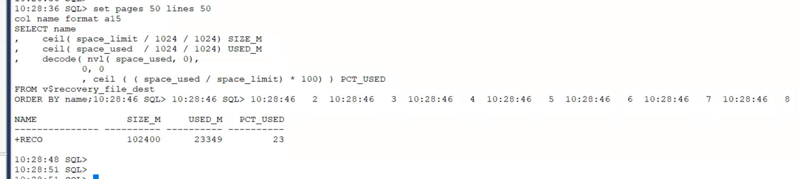

# Indication FRA Full

#### Info error on side app simillar like :




#### Then after checking FRA,  It turns out that Peercent's FRA usage is already full :

#### Then, to overcome this, the options are to add space from the file or do an HK or delete the archive log. 
#### I chose to delete the archivelog leaving the last 30 days of the archivelog;

### 1. Check first and confirm with the PIC
```bash
rman target /
```
```bash
list archivelog until time 'sysdate-30';
```
```bash
crosscheck archivelog until time 'sysdate-30';
```

### 2. And if it has been confirmed, then according to the previous agreement we can delete the archivelog leaving the last 30 days with the following query via RMAN
```bash
rman target / 
```
```bash
delete archivelog until time 'sysdate-30'; 
```

#### Before carrying out the action above, make sure that discussions and confirmation of the relevant env have been carried out.

#### Then the issue is solved.

```bash
set pages 50 lines 50
col name format a15
SELECT name
,    ceil( space_limit / 1024 / 1024) SIZE_M
,    ceil( space_used  / 1024 / 1024) USED_M
,    decode( nvl( space_used, 0),
        0, 0
        , ceil ( ( space_used / space_limit) * 100) ) PCT_USED
FROM v$recovery_file_dest
ORDER BY name;
```



### Additional

#### /Month
```bash
SELECT trunc (completion_time) TIME,
SUM(BLOCKS * BLOCK_SIZE) /1024/1024/1024 SIZE_GB
FROM v$archived_log
group by trunc(completion_time)
ORDER BY 1;
```

#### /Hour
```bash
col hour for a20
select to_char(trunc(COMPLETION_TIME,'HH'),'dd-mm-yyyy HH24:MI:SS') Hour,thread# , 
round(sum(BLOCKS*BLOCK_SIZE)/1024/1024/1024) GB,
count(*) Archives from v$archived_log 
--where trunc(COMPLETION_TIME) = '02-JAN-23'
group by trunc(COMPLETION_TIME,'HH'),thread#  order by 1 ;
```

#### /Day
```bash
select trunc(COMPLETION_TIME,'DD') Day, thread#, 
round(sum(BLOCKS*BLOCK_SIZE)/1024/1024/1024) GB,
count(*) Archives_Generated from v$archived_log 
group by trunc(COMPLETION_TIME,'DD'),thread# order by 1;
```

```bash
crosscheck archivelog all;
```
```bash
crosscheck archivelog until time 'sysdate-1';
```
```bash
crosscheck archivelog until time '18-DEC-23';
```
```bash
delete archivelog until time '18-DEC-23';
list archivelog all;
```
```bash
list archivelog from time '16-DEC-23' until time '18-DEC-23';
```
```bash
list archivelog from time '16-DEC-23' until time '18-DEC-23';
```
```bash
delete archivelog from time '16-DEC-23' until time '18-DEC-23';
```


