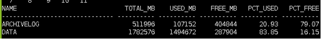
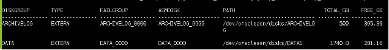
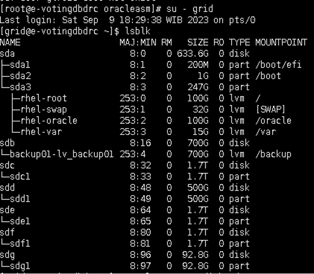
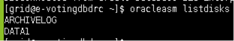
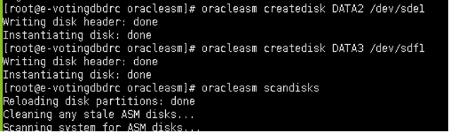
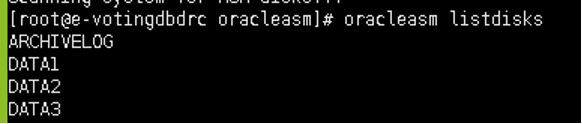
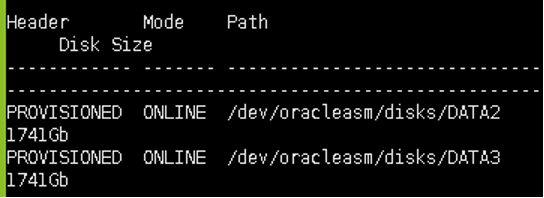
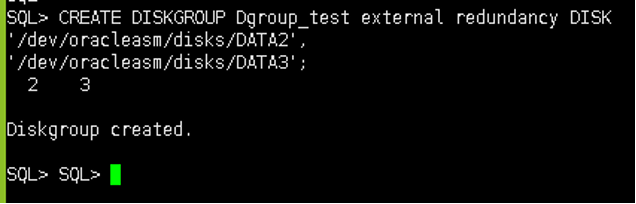

# Restart ODG and MOP How To Add ASM

## 1. Check ASM_DISK dan ASM_DISKGROUP Information on DC Side with User Grid

### Command Step 1
```bash
su - grid 
```
```bash
sqlplus / as sysasm
```
```bash
set lines 500 pages 500
SELECT g.name,
       sum(b.total_mb) total_mb,
       sum((b.total_mb - b.free_mb)) used_mb,
       sum(B.FREE_MB) free_mb,
       decode(sum(b.total_mb),0,0,(ROUND((1- (sum(b.free_mb) / sum(b.total_mb)))*100, 2))) pct_used,
       decode(sum(b.total_mb),0,0,(ROUND(((sum(b.free_mb) / sum(b.total_mb)))*100, 2))) pct_free
FROM
     v$asm_disk b,v$asm_diskgroup g
where b.group_number = g.group_number (+)
group by g.name
order by 1;
```


```bash
set lines 500 pages 500
col diskgroup for a15
col type for a15
col failgroup for a18
col asmdisk for a20
col path for a30
SELECT dg.name diskgroup,dg.type,d.failgroup, d.name asmdisk,d.path,round(d.total_mb/1024,2)total_gb,round(d.free_mb/1024,2)free_gb 
FROM v$asm_diskgroup dg join v$asm_disk d on dg.group_number=d.group_number order by 4;
```



## 2. Check Raw Disks

Note: Pastikan raw disks terbaca di kedua node


### Command Step 2
```bash
lsblk
```


## 3. Format disks dengan ASMLIB dengan user ROOT (Ini jika belum dibantu oleh team OS)

### Command Step 3
```bash
su - root
```
```bash
oracleasm listdisks
```


```bash
oracleasm createdisk NAME /PATH
```


```bash
oracleasm listdisks
```


## 4. Check Disks pada node 2 

### Command Step 4
```bash
su - root

# oracleasm scandisks
# oracleasm listdisks
```

## 5 Check FORMER or CANDIDATE Disks

### Command Step 5

```bash
su - grid
```
```bash
sqlplus / as sysasm
```
```bash
SELECT header_status              "Header"
, mode_status                     "Mode"
, path                            "Path"
, lpad(round(os_mb/1024),7)||'Gb' "Disk Size"
FROM   v$asm_disk
WHERE header_status in ('FORMER','CANDIDATE','PROVISIONED')
ORDER by path
```


## 5. Create New Diskgroup Test

### Command Step 5

```bash
su - grid
```
```bash
sqlplus / as sysasm
```
```bash
CREATE DISKGROUP Dgroup_test external redundancy DISK 
'/dev/oracleasm/disks/DATA2',
'/dev/oracleasm/disks/DATA3';
```


