# ORACLE LINUX INSTALLATION ORACLE DATABASE

## TOC
- [Why do we choose Oracle Linux?](#why-do-we-choose-oracle-linux)
- [How to download Oracle Linux boot image?](#how-to-download-oracle-linux-boot-image)
- [How to boot your Virtual Machine (VM) from Oracle Linux boot image?](#how-to-boot-your-virtual-machine-vm-from-oracle-linux-boot-image)
- [How to complete Oracle Linux Installation?](#how-to-complete-oracle-linux-installation)

## Why do we choose Oracle Linux?
* Oracle recommends that you install Oracle Linux for Oracle Database software reliable work and best performance.
* You can use Oracle Database Preinstallation RPM to configure your operating systems for Oracle Database and Oracle Grid Infrastructure installations.

## How to download Oracle Linux boot image?
* Go to [Oracle Software Delivery Cloud](https://edelivery.oracle.com/)
* Sign in (Create an account if you don't have one)
* Select **Release** category from the dropdown menu and type **Oracle Linux** in the search field like on the picture below and press **Search** button:
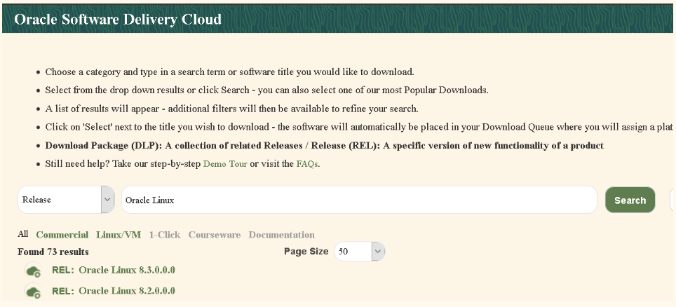
* For **Platforms/Languages** select **x86_64** like on the image and press **Continue** button
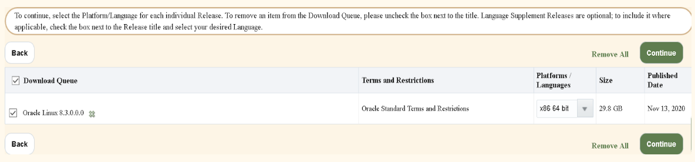
* Accept Oracle License Agreement and press **Continue** button 
* Leave only checkbox next to **Oracle Linux Release 8 Update 3 Boot ISO image for x86 (64 bit), 668.0 MB** file like on the image and press **Download** button
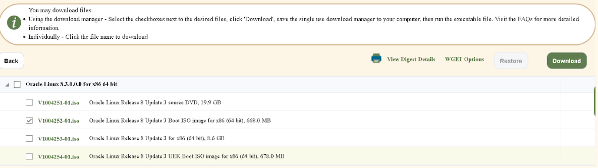
* Run the downloaded executable file. It will start download manager that will download file you chose on the previous step

## How to boot your Virtual Machine (VM) from Oracle Linux boot image?
* Open VirtualBox Manager
* Select your VM and press **Settings** button 
* Select **Storage -> Disc (Empty)** icon -> in the Disc drop down menu select **Choose a disk file..** and choose a boot image we downloaded on the previous step and press **OK** button. Here is an example on the picture below:
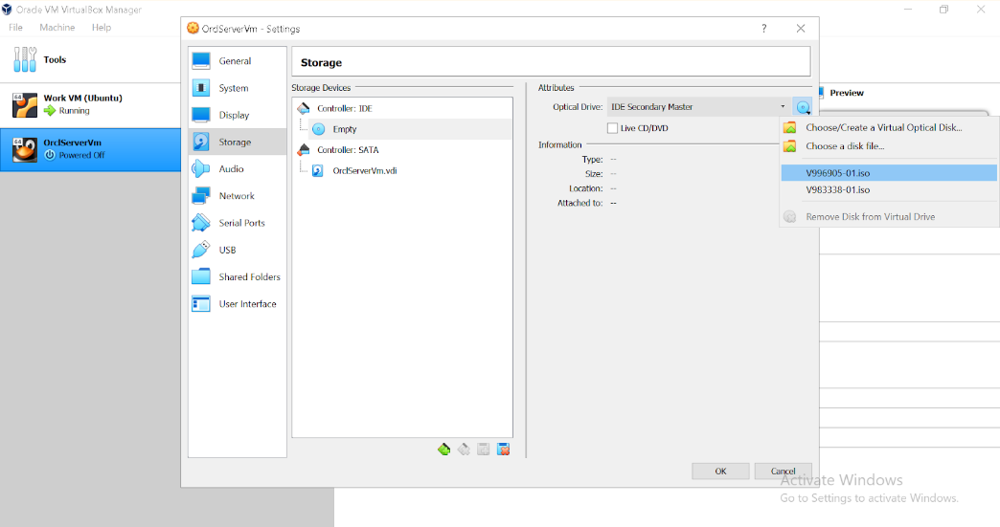
* Start your VM
* Choose the **Install Oracle Linux option** in the load menu
* Wait for the Linux to boot and Installation Menu window

## How to complete Oracle Linux Installation?
* Choose the language for the installation and press **Continue**
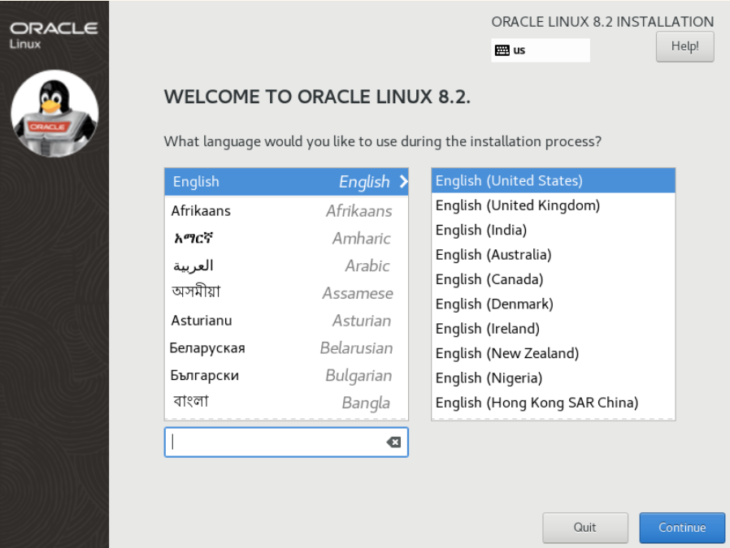
* You will be taken to the installation Summary screen as shown below where you have to complete all configuration items.
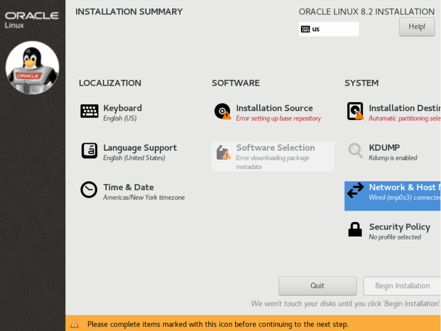
* Go to **Network & Host** settings and click the **ON/OFF** button in the right corner to activate the interface. The IP Address/Default Route/DNS should be assigned by DHCP. Provide the **Host Name** for your server as well. An example on the picture below.
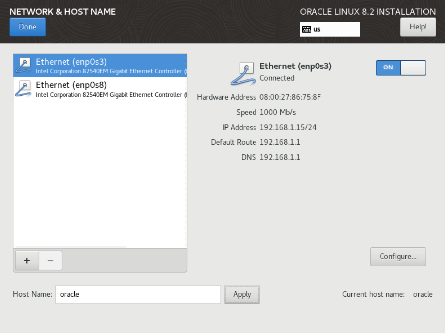
* Go to **Installation Source** settings. Make sure **On the network** checkbox is checked, **URL type: repository URL** and provide the following YUM Repository URL :
yum.oracle.com/repo/OracleLinux/OL8/baseos/latest/x86_64
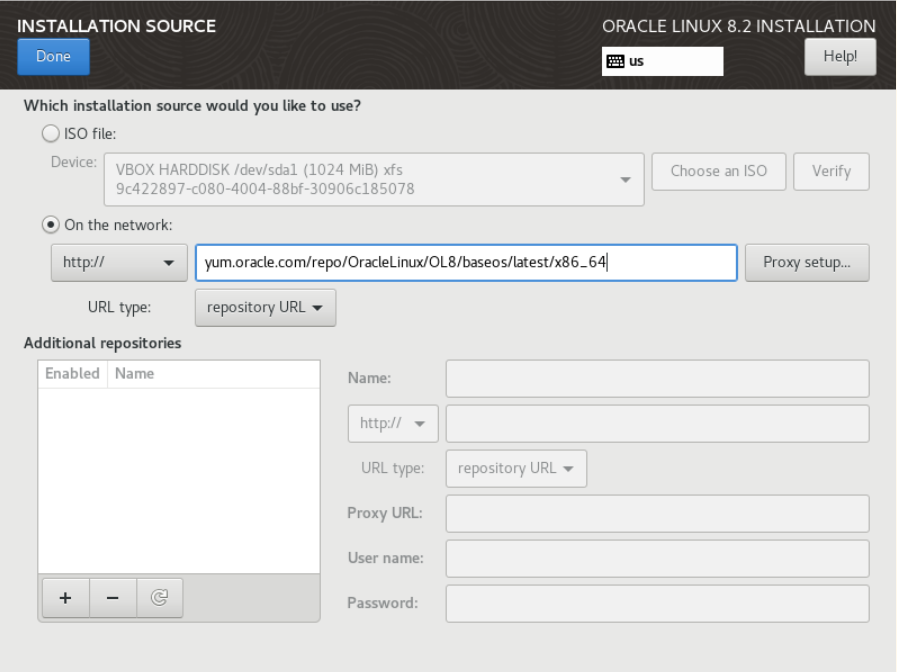
* Go to **Software Selection** settings. Leave checkbox as it is on **Server** and click **Done**
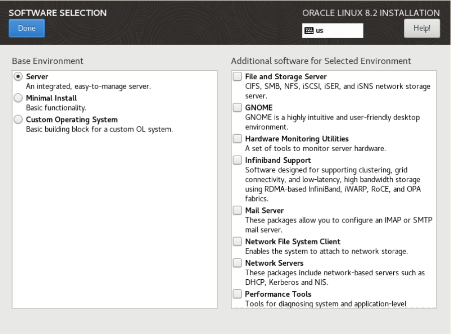
* Go to **Installation Destination** settings. Chose **Custom** checkbox for **Storage Configuration** section and click **Done**
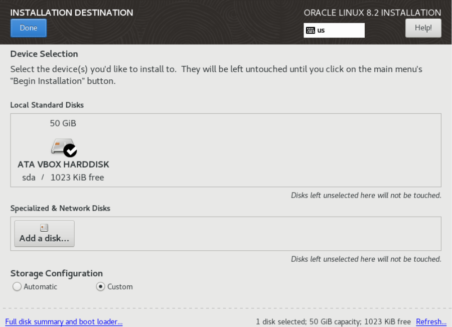
* Create 3 standard partitions by clicking on **+** sign like on image below:
    + Mount Point : **/boot** Desired Capacity: 1 GiB
    + Mount Point : **swap** Desired Capacity: 5 GiB
    + Mount Point : **/** Desired Capacity: leave empty it will allocate all available space automatically
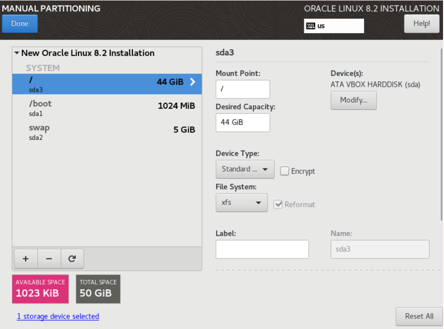
* Click the **Begin Installation** to start copying file and installing the Operating System.
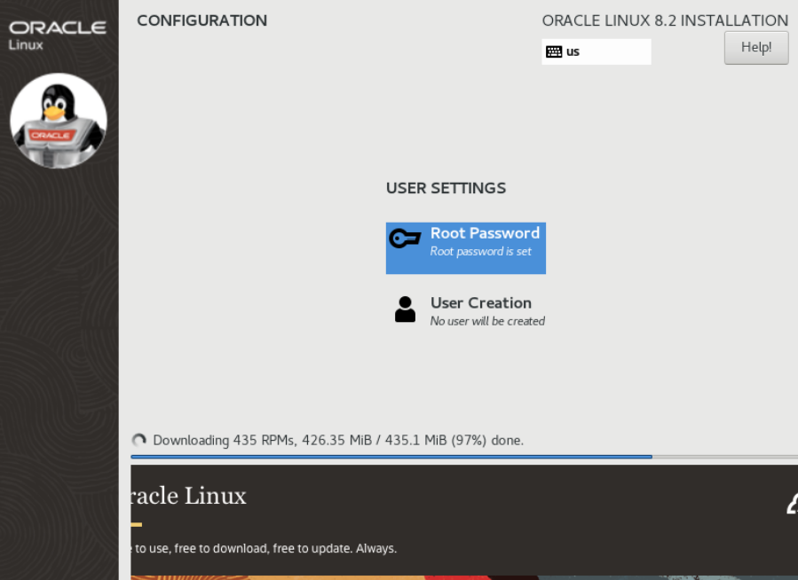
* Now it's time to wait for the installation to complete. Meanwhile you can create the **Root** password. After the installation is complete click the **Reboot** button and try to login with the user **root** and password you created earlier(remember password!)