# ORACLE DATABASE SILENT INSTALLATION

## TOC
- [Why don't we use GUI graphical user interface to install Oracle Database?](#why-dont-we-use-gui-graphical-user-interface-to-install-oracle-database)
- [How to start and connect to your Server?](#how-to-start-and-connect-to-your-server)
- [Do we need to configure Linux for Oracle Database optimal work?](#do-we-need-to-configure-linux-for-oracle-database-optimal-work)
- [How to download Oracle Database Software?](#how-to-download-oracle-database-software)
- [How to deliver an Oracle Database Software archive file from your host machine (Windows) to the server (Linux)?](#how-to-deliver-an-oracle-database-software-archive-file-from-your-host-machine-windows-to-the-server-linux)
- [How to install Oracle 19c database software in silent mode on Linux x86_64?](#how-to-install-oracle-19c-database-software-in-silent-mode-on-linux-x86_64)

## Why don't we use GUI graphical user interface to install Oracle Database?
* In 99% of cases there is no graphical user interface on production database servers
* Not easy to automate - to install Oracle Database on 100 servers with the same configuration will take forever if you will be doing it manually via GUI

Most of the time people who start learning Oracle Database install software using **./runInstaller** graphical user interface. It is easy and user friendly. User select required checkboxes and press **NEXT, NEXT, CONTINUE** buttons. But in the real world you would like to use a **Silent Mode** installation that allows to you configure necessary Oracle components without using a graphical interface. In this manual I will show you how to use the **Silent Mode** installation and **response file** to provide all the required information for the installation, so no additional user input is required.

## How to start and connect to your Server?
* Make sure the Disk has been ejected from Virtual Drive after Oracle Linux Installation. You should see Empty message near the disc icon (like on the 2nd image below) If not you should open your **VM settings -> Storage -> Remove Disk from Virtual Drive**
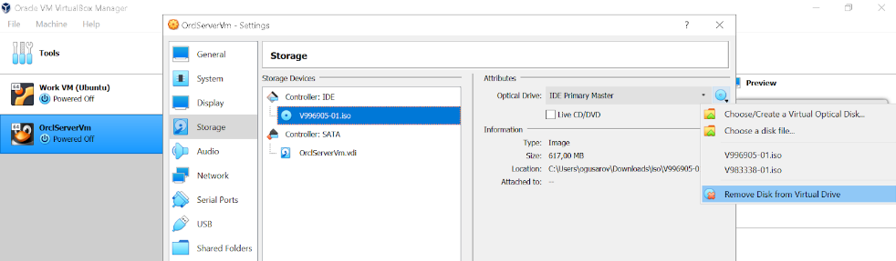
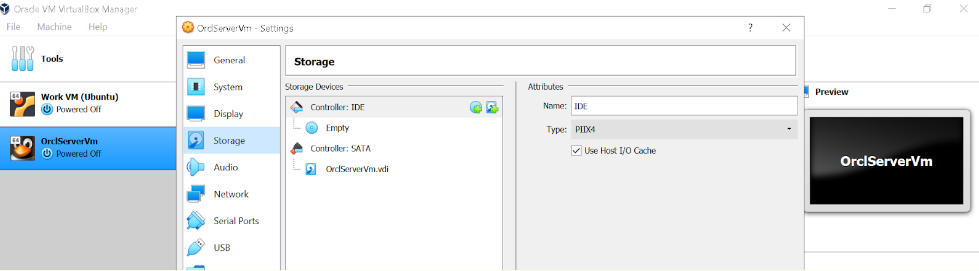
* Start you VM and login as root user (you created root user and password during linux installation)
* Find out and remember the IP ADDRESS assigned to the server. In the terminal window run **ip addr** command to list and show all ip address associated on on all network interface:
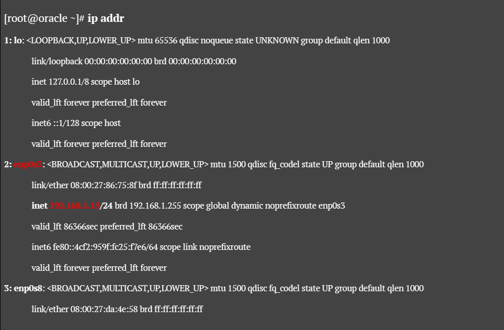
* Open putty (for Windows user) or any other ssh client on your host machine and connect to your server by providing IP ADDRESS. Press **Open** button and then you will be requested to provide USER/PASSWORD information to login:
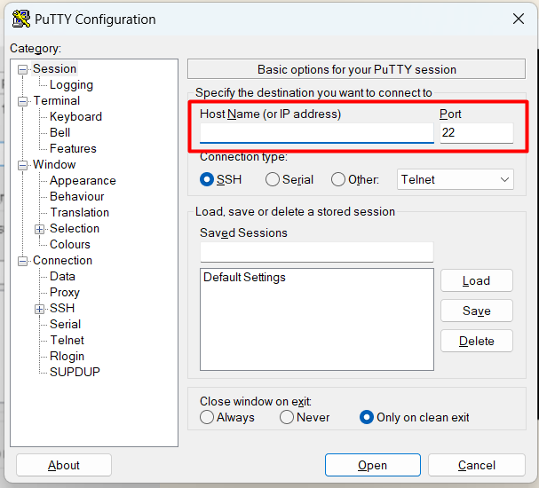

## Do we need to configure Linux for Oracle Database optimal work?
Sure! Follow this steps to configure your Oracle Linux:
* It is a good practice to update all the packages to the newest version. Run in terminal **yum update** command and type **"y"** (yes) when asked:
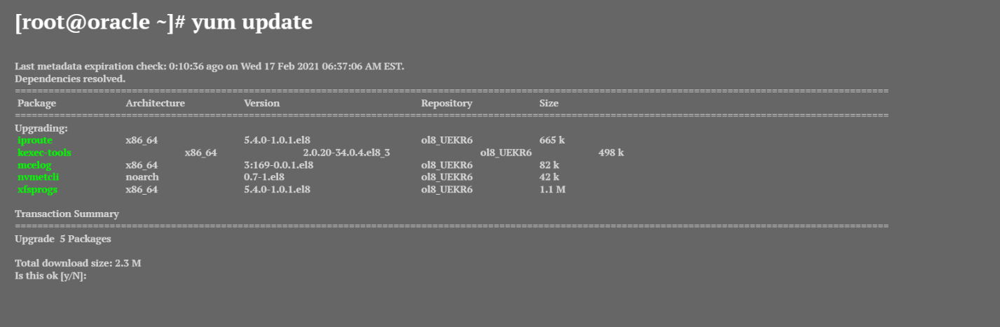
* Restart you Server. You should relogin after this operation
**[root@oracle ~]# reboot**
```bash
reboot
```
* If your Linux distribution is Oracle Linux, or Red Hat Enterprise Linux then you can complete most preinstallation configuration tasks by using the Oracle Preinstallation RPM for your release by running **yum install oracle-database-preinstall-19c** command and type **"y"** (yes) when asked
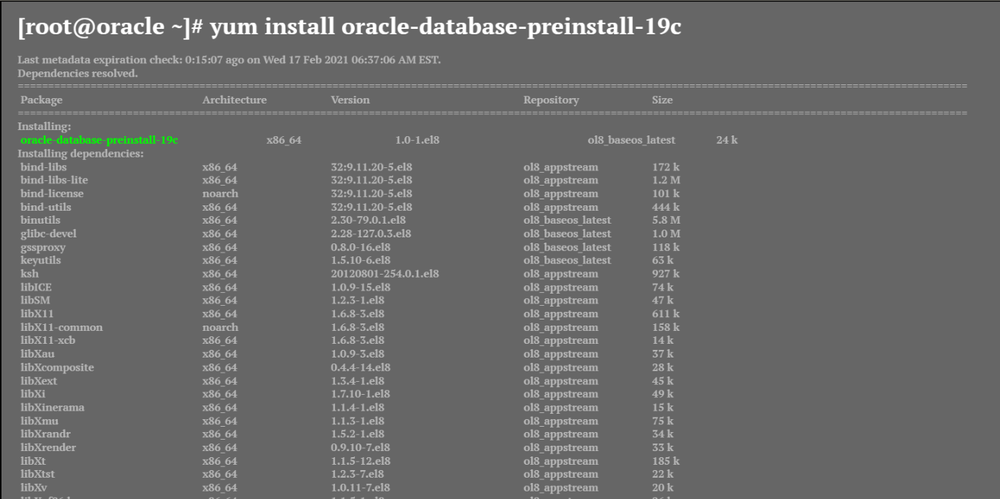
```bash
yum install oracle-database-preinstall-19c
```

## How to download Oracle Database Software?
* Go to [Oracle Software Delivery Cloud](https://edelivery.oracle.com/)
* Sign in (Create an account if you don't have one)
* Select **Release** category from the dropdown menu and type **Oracle Database** in the search field like on the picture below and press **Search** button:
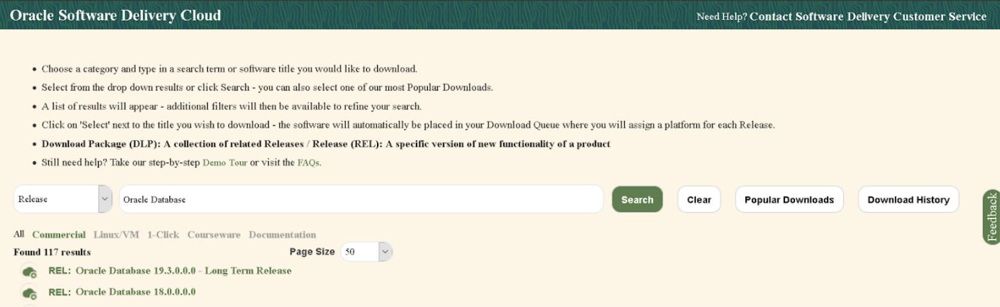
* Select **Oracle Database 19.3.0.0.0 - Long Term Release** and press **Continue** button
* For **Platform/Languages** you should pick up **Linux x86_64** from the drop down menu and press **Continue**
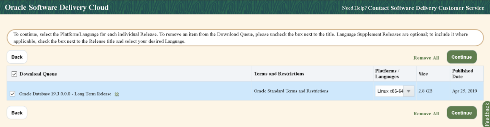
* You should review and accept the Oracle License Agreement
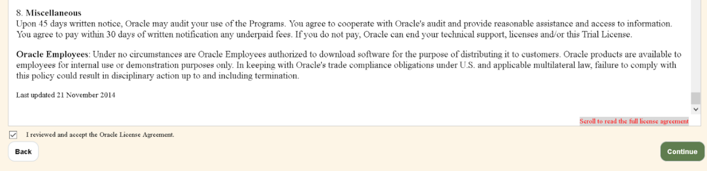
* Press **Download** button and save EXE file
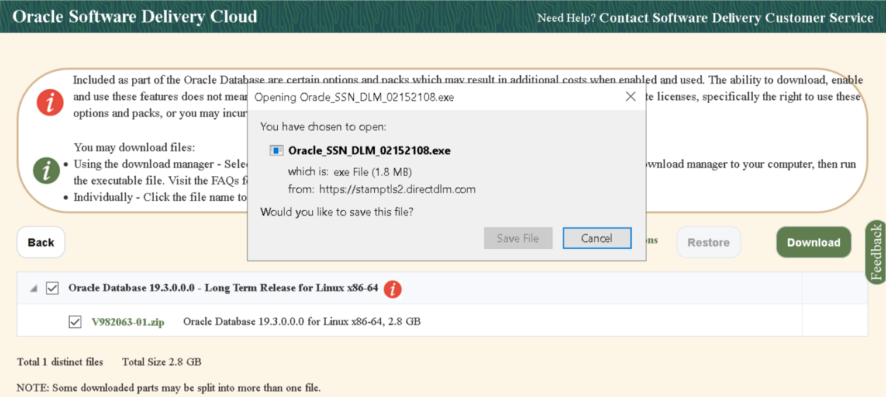
* Run a saved executable fix (Oracle_SSN_DLM_----) and Oracle Download Manager will be started. You should provide the path for the archive to be downloaded and start the process. If you did everything right download process should be started like on the image below:
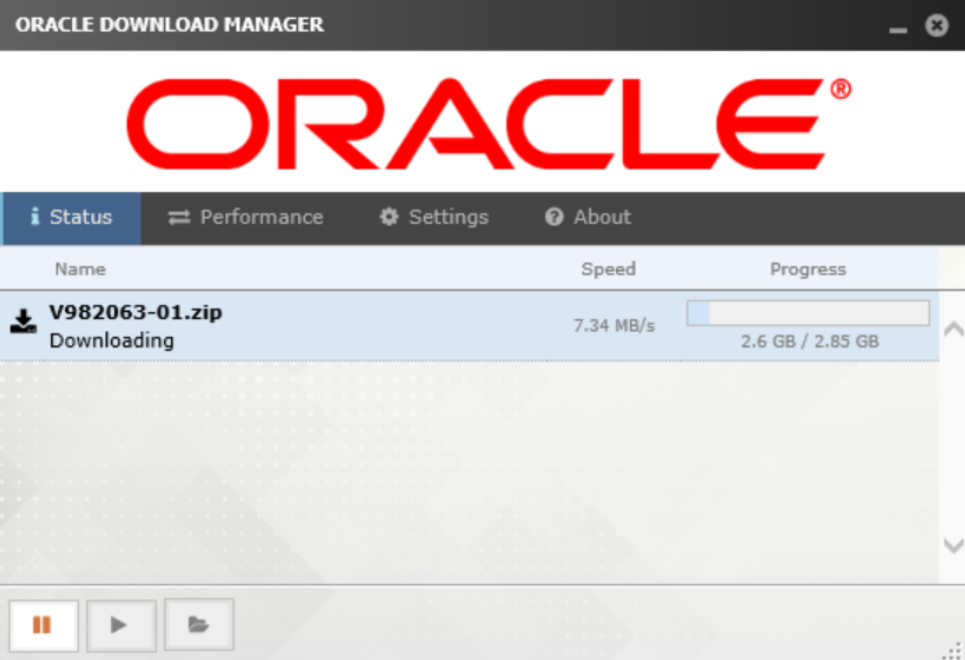

## How to deliver an Oracle Database Software archive file from your host machine (Windows) to the server (Linux)?
* Open Windows **Command Prompt** terminal (you can type cmd in windows search) and copy zip archive you downloaded on the previous step
```bash
scp direktory file root@your ip address:/root/ 
```
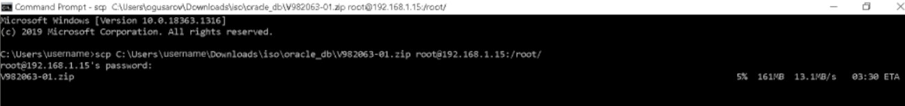

## How to install Oracle 19c database software in silent mode on Linux x86_64?
* Login to the server as a **root** user. Create a directory for Oracle Database home. Move the software archive file we copied to the server on the previous step to this directory. Change permissions recursively for /u01 directory to be owned by **oracle** user
```bash
mkdir -p /u01/app/oracle/product/19.0.0/db_1
mv /root/V982063-01.zip /u01/app/oracle/product/19.0.0/db_1/
chown -R oracle:oinstall /u01
```

* Change user to **oracle** and unzip software archive file:
```bash
su oracle
cd /u01/app/oracle/product/19.0.0/db_1
unzip V982063-01.zip
```

* Backup response file
```bash
cp /u01/app/oracle/product/19.0.0/db_1/install/response/db_install.rsp{,_original}
```
* Modify response file:
```bash
vi /u01/app/oracle/product/19.0.0/db_1/install/response/db_install.rsp
```
You can ignore the lines that start with # digit, it is comment. Blue lines is the ones that should be changed.
You can download set [**rsp file**](https://drive.google.com/file/d/1286TZH1BrAeS1bDmKEt8HwTyKoapeiEL/view?usp=sharing) here
* As an ORACLE USER, execute Prequisites check. You should see the "Prerequisite checks executed successfully" message. But it looks like Oracle Linux 8 was not added to supported releases in Oracle Database Software and Prerequisites check doesn't return this message now. It should be fixed in future releases. Anyway we can still install Oracle Database.

```bash
cd /u01/app/oracle/product/19.0.0/db_1
./runInstaller -executePrereqs -silent -responseFile /u01/app/oracle/product/19.0.0/db_1/install/response/db_install.rsp
```
* An attempt to install Oracle Software finishes with error. I described the root cause for this behavior in the previous step. It is a good example why should do diligent QA tests of a Linux & Database configuration before using it for a production environment. Oracle RDBMS 19c is now certified on Oracle Linux 8. Unfortunately the Oracle Universal Installer in Silent Mode fails when checking the OS version. Move to the next step with work arround for this problem.
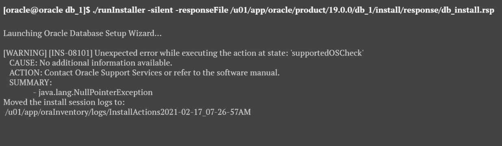
```bash
./runInstaller -executePrereqs -silent -responseFile /u01/app/oracle/product/19.0.0/db_1/install/response/db_install.rsp
```
* Install Oracle Software in Silent Mode by running the following commands. The 1st command is work around for the problem we were talking about above. The 2nd command starts Oracle Universal Installer in silent mode that uses provide response file with all the required information for the installation. Pay attention on the instructions you are provide in the output of the last command:
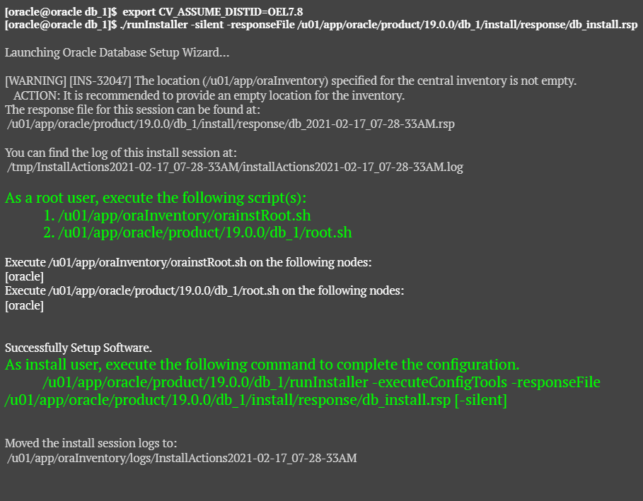
```bash
export CV_ASSUME_DISTID=OEL7.8
./runInstaller -executePrereqs -silent -responseFile /u01/app/oracle/product/19.0.0/db_1/install/response/db_install.rsp
./runInstaller -silent -responseFile /u01/app/oracle/product/19.0.0/db_1/install/response/db_install.rsp
```
* As suggested in instruction execute the following scripts as a ROOT user
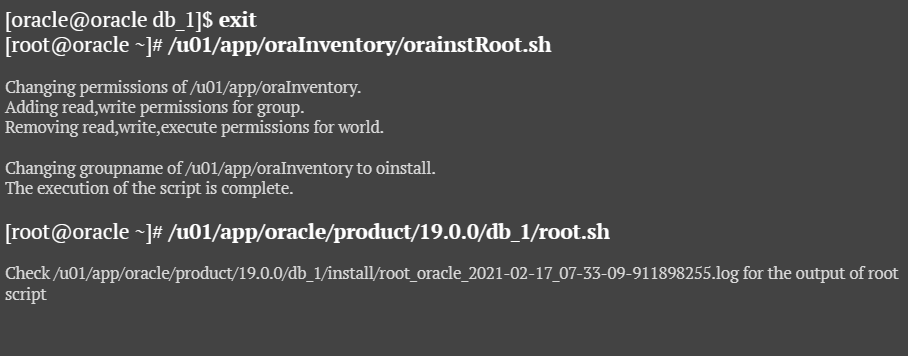
```bash
exit
/u01/app/oraInventory/orainstRoot.sh
```
```bash
/u01/app/oracle/product/19.0.0/db_1/root.sh
```

* Finally execute the following commands as ORACLE user to complete configurations of Oracle Database. This operation will take some times to finish. You can have a cup of coffe now.
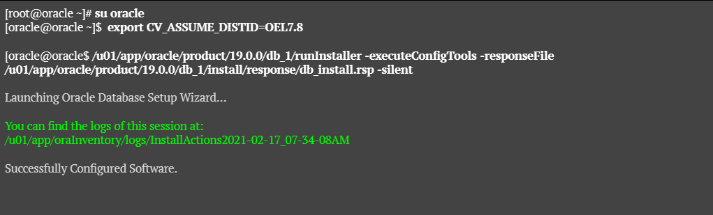

```bash
[root@oracle ~]# su oracle
[oracle@oracle ~]$  export CV_ASSUME_DISTID=OEL7.8
[oracle@oracle ~]$ /u01/app/oracle/product/19.0.0/db_1/runInstaller -executeConfigTools -responseFile /u01/app/oracle/product/19.0.0/db_1/install/response/db_install.rsp -silent
```
* That's it! You complete Oracle Database installation and configuration. Now you can try to login to Oracle Database and run some commands to check it is working:
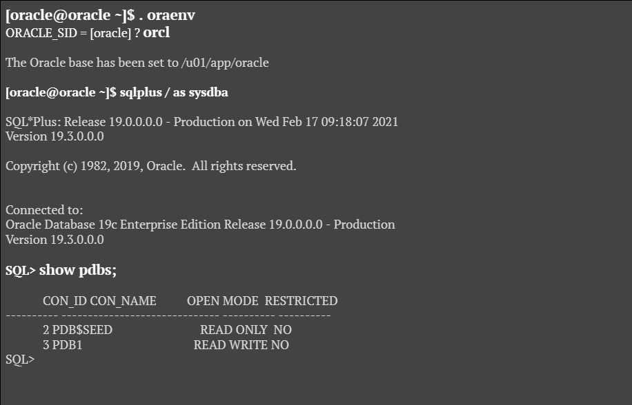


