# ORACLE DATA GUARD

## TOC
* [Prerequisites](#prerequisites)
* [What is Oracle Data Guard and why should we use it?](#what-is-oracle-data-guard-and-why-should-we-use-it)
* [What different standby types can we configure?](#what-different-standby-types-can-we-configure)
* [What types of Data Guard Service are used to keep Standby in sync with Primary?](#what-types-of-data-guard-service-are-used-to-keep-standby-in-sync-with-primary)
* [Describe Oracle Data Guard Architecture?](#describe-oracle-data-guard-architecture)
* [What is the general plan to configure Data Guard?](#what-is-the-general-plan-to-configure-data-guard)
* [How to configure Primary DB?](#how-to-configure-primary-db)
* [How to prepare a Standby server?](#how-to-prepare-a-standby-server)
* [How to set up Net Services between Primary and Standby?](#how-to-set-up-net-services-between-primary-and-standby)
* [How to Create Standby?](#how-to-create-standby)

## Prerequisites
You should know the SYS user password. You can use the following command to find out your SYS password if you kept the initial password specified in lesson Oracle DB Silent Installation for the DB software installation step:
```bash
grep oracle.install.db.config.startedb.password_SYSTEM
```

## What is Oracle Data Guard and why should we use it?
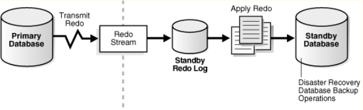

Oracle Data Guard ensures high availability, data protection, and disaster recovery for enterprise data. It provides a comprehensive set of services that create, maintain, manage, and monitor one or more standby to enable production oracle database to survive disasters and data corruptions. Data Guard maintains these standby database as transaction consistent copies of the production database.

If the production database becomes unavailable because of a planed or an unplanned outage, Data Guard can switch any stanby database to the production role, minimizing the downtime associated with the outage. Data Guard can be used with traditional backup, restoration, and cluster techniques to provide a high level of data protection and data availabilty.

With Data Guard, administrators can optionally improve production database performance by offloading resource intensive backup and reporting operations to standby systems. 

A Data Guard configuration consist of one production database and one or more standby databases. The databases in a Data Guard configuration are connected by Oracle Net and may be dispersed geographically. There are no restrictions on where the databases are located, provided they can communicate with each other. For example, you can have a standby database on the same system as the production database, along with two standby database on other system at remote locations.

## What different standby types can we configure?
* **Physical standby database** is provide a physically identical copy of primary database, with on-disk database structures that are identical to the primary database on a block-for-block basis. A physical standby database is keep synchronized with the primary database, through Redo Apply, which recovers the redo data received from the primary database and applies the redo to the physical standby database.
* **Logical standby database** A logical standby database is a synchronized copy of the primary database that is kept updated by continuously applying SQL statements from the primary database. It provides real-time data protection and can be used for various purposes such as reporting, offloading read-only workloads, or as a disaster recovery solution. Unlike physical standby databases, a logical standby database is open for read and write operations, allowing users to perform queries and modifications.
* **Snapshot standby database** A snapshot standby database is a variation of a physical standby database that allows it to be temporarily converted into a read/write database for testing or reporting purposes. In a snapshot standby configuration, the physical standby database operates as a normal physical standby database most of the time, applying redo data from the primary database. However, it can be converted into a snapshot standby database to create a writable snapshot of the primary database, enabling users to run queries or perform tests without affecting the primary database. Once the snapshot standby database is no longer needed, it can be easily converted back to a physical standby database.

## What types of Data Guard Service are used to keep Standby in sync with Primary?

* **Redo Transport Service** Is used for the transmission of redo information from the primary database to one or more standby database.
* **Redo/SQL apply Service** it maintains how data is applied to standby database, by one of the following ways. 
    + **Redo Apply** : Uses media recovery to keep data is applied to standby databases, by one of the following ways.
    + **SQL Apply** : Reconstructs SQL statements from the redo received from the primary database and execute the SQL statements against the logical standby database.

## Describe Oracle Data Guard Architecture?
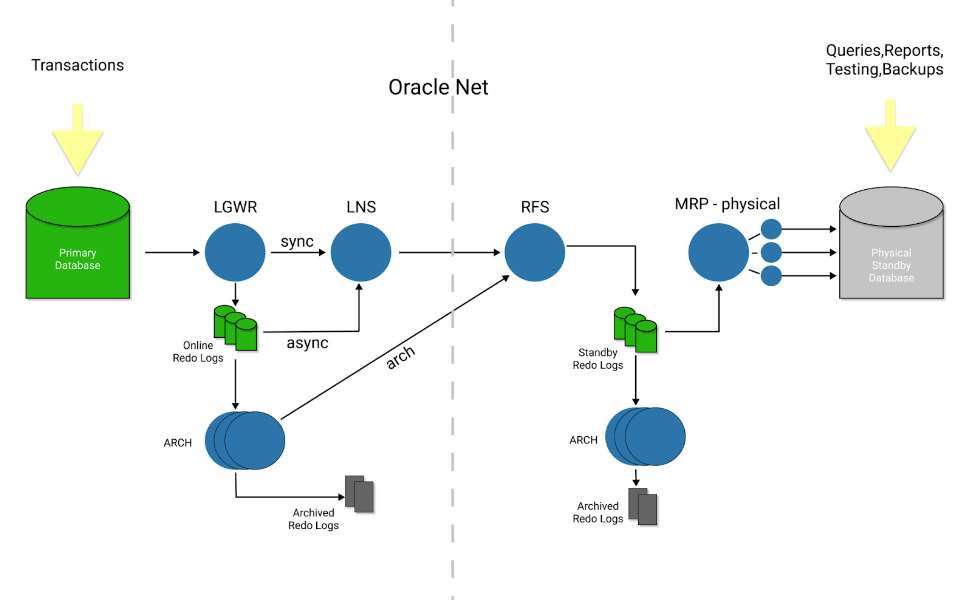

Customers create workload on the primary database. This activity fills the log buffer. Whenever any change are made to the database and LGWR[log writer] process does it work and writes transaction information to online redo log files. When log switch occurs ARCn process awakes and content of the online redo log file will be flushed to Archive redo log files.

## What is the general plan to configure Data Guard?
The general plan consists of 5 main steps:

1. Prepare Primary Database.
2. Prepare Standby Server.
3. Set up Net Services between primary and stanby databases.
4. Create a Standby Database.

| DB Role  | DB Name  | Server IP  |
| -------- | -------- | -------- |
| Primary DB   | ORCLDB   | 192.168.1.15   |
| Standby DB   | STBY_ORCLDB   | 192.168.1.11   |

## How to configure Primary DB?
Note : If not specified otherwise I assume you are logged in with SYSDBA permissions when performing commands for this lesson:
```bash
[oracle@oracle ~]$ sqlplus / as sysdba
```
Before you create a standby database you must first ensure the primary database in properly configured.
* ARCHIVELOG mode must be enabled on the Primary DB
```bash
SQL> archive log list;
SQL> shutdown immediate;
SQL> startup mount;
SQL> alter database archivelog;
SQL> alter database open;
SQL> archive log list;
SQL> select NAME, OPEN_MODE, LOG_MODE from v$database;
```
* We want to use FLASHBACK database. To enable flashback, set UNDO_RETENTION and restart instance with the following commands:
```bash
SQL> ALTER SYSTEM SET UNDO_RETENTION=900 SCOPE=both;
SQL> ALTER DATABASE FLASHBACK ON;
SQL> shutdown immediate;
SQL> startup;
```
* As part preparing the primary database for standby database creation, you must enable a logging mode appropriate to the way you plan to use the Data Guard configuration. We are going to use FORCE LOGGING mode.
```bash
SQL> SELECT FORCE_LOGGING FROM v$DATABASE;
SQL> ALTER DATABASE FORCE LOGGING;
```
* Next we need to configure initialization parameters that control redo data transportation to the standby system and the archiving of redo data on local file system while the database is in the primary role.
```bash
SQL> ALTER SYSTEM SET LOG_ARCHIVE_CONFIG='DG_CONFIG=(ORCLDB,STBY_ORCLDB)' SCOPE=both;
SQL> ALTER SYSTEM SET LOG_ARCHIVE_DEST_1='LOCATION=USE_DB_RECOVERY_FILE_DEST VALID_FOR=(ALL_LOGFILES,ALL_ROLES) DB_UNIQUE_NAME=ORCLDB' SCOPE=both;
SQL> ALTER SYSTEM SET LOG_ARCHIVE_DEST_2='SERVICE=STBY_ORCLDB ASYNC NOAFFIRM VALID_FOR=(ONLINE_LOGFILES,PRIMARY_ROLE) DB_UNIQUE_NAME=STBY_ORCLDB' SCOPE=both;
```
* Set the maximum number of ARCn processes that can be created with the following command:
```bash
SQL> ALTER SYSTEM SET LOG_ARCHIVE_MAX_PROCESSES=2 SCOPE=both;
```
* The following commands show the additional standby role initialization parameters on the primary database. These parameters take effect when the primary database in transitioned to the standby role.
```bash
SQL> ALTER SYSTEM SET fal_server='STBY_ORCLDB' scope=both;
SQL> ALTER SYSTEM SET STANDBY_FILE_MANAGEMENT=AUTO SCOPE=spfile;
SQL> ALTER SYSTEM SET db_file_name_convert='/u01/app/oracle/product/19.0.0/db_1/mydbfiles/STBY_ORCLDB','/u01/app/oracle/product/19.0.0/db_1/mydbfiles/ORCLDB' SCOPE=spfile;
SQL> ALTER SYSTEM SET log_file_name_convert='/u01/app/oracle/product/19.0.0/db_1/mydbfiles/STBY_ORCLDB','/u01/app/oracle/product/19.0.0/db_1/mydbfiles/ORCLDB' SCOPE=spfile;
```
* If you don't want to specify location for the Standby Redo logs we need to enable OMF for redo logs. The DB_CREATE_ONLINE_LOG_DEST_n parameters in the "init.ora" file decided on the locations and numbers of logfile members
```bash
SQL> ALTER SYSTEM SET DB_CREATE_ONLINE_LOG_DEST_1='/u01/app/oracle/product/19.0.0/db_1/mydbfiles/';
```
* Oracle recommends that each standby redo log group must have at least one or more redo log member than the redo log group at the source database.
```bash
SQL> ALTER DATABASE ADD STANDBY LOGFILE THREAD 1 SIZE 200M;
SQL> ALTER DATABASE ADD STANDBY LOGFILE THREAD 1 SIZE 200M;
SQL> ALTER DATABASE ADD STANDBY LOGFILE THREAD 1 SIZE 200M;
SQL> ALTER DATABASE ADD STANDBY LOGFILE THREAD 1 SIZE 200M;
```
* Create adump and backup directories on the Primary DB node:
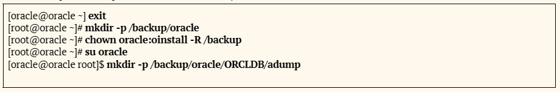
```bash
[oracle@oracle ~]$ exit
[root@oracle ~]# mkdir -p /backup/oracle
[root@oracle ~]# chown oracle:oinstall -R /backup
[root@oracle ~]# su oracle
[oracle@oracle root]$ mkdir -p /backup/oracle/ORCLDB/adump
```
* Create a PFILE from SPFILE:
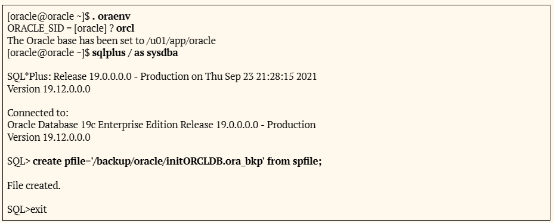
```bash
[oracle@oracle ~]$ .oraenv
[oracle@oracle ~]$ sqlplus / as sysdba

SQL> create pfile='/backup/oracle/initORCLDB.ora_bkp' from spfile;
SQL> exit
```
* Create a primary DB backup
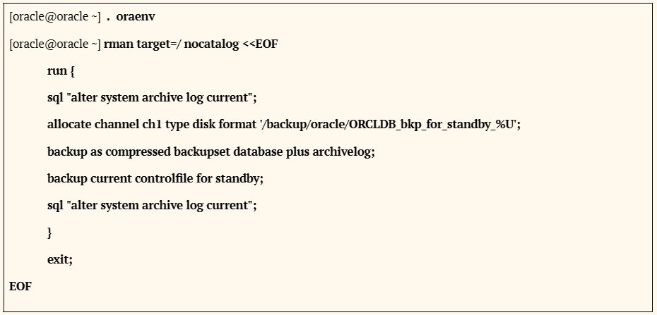
```bash
[oracle@oracle ~]$ .oraenv
[oracle@oracle ~]$ rman target=/ nocatalog <<EOF
        run{
            sql "alter system archive log current";
            allocate channel ch1 type disk format '/backup/oracle/ORCLDB_bkp_for_standby_%U';
            backup as compressed backupset database plus archivelog;
            backup current controlfile for standby;
            sql "alter system archive log current";
        }
        exit;
    EOF
```
Note: if it is not the first attempt to a create backup you must turn off backup optimization in RMAN:
```bash
RMAN> CONFIGURE BACKUP OPTIMIZATION OFF;
```
* Copy a password file to the backup directory you created earlier
```bash
cp $ORACLE_HOME/dbs/orapworcl /backup/oracle
```
* remote_login_passwordfile initialization parameters must be set to **EXCLUSIVE** if a remote login password file is used to authenticate administrative users or redo transport sessions
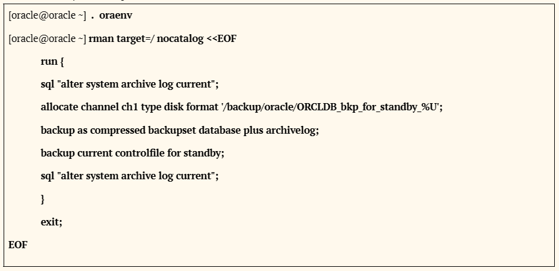
```bash
SQL> show parameter REMOTE_LOGIN_PASSWORDFILE;
```
## How to prepare a Standby server?
* We need to create a New VM
* Install the same Oracle Linux Release as on Primary
* Install Database Software only, lets prepare a response file for the DB Software installation:
```bash
vi /u01/app/oracle/product/19.0.0/db_1/install/response/db_install.rsp
```
* For rsp file you only change on this section:
```bash
oracle.install.option=INSTALL_DB_SWONLY
UNIX_GROUP_NAME=oinstall
INVENTORY_LOCATION=/u01/app/oraInventory
ORACLE_HOME=/u01/app/oracle/product/19.0.0/db_1
ORACLE_BASE=/u01/app/oracle
oracle.install.db.InstallEdition=EE
oracle.install.db.OSDBA_GROUP=oinstall
oracle.install.db.OSOPER_GROUP=oinstall
oracle.install.db.OSBACKUPDBA_GROUP=oinstall
oracle.install.db.OSDGDBA_GROUP=oinstall
oracle.install.db.OSKMDBA_GROUP=oinstall
oracle.install.db.OSRACDBA_GROUP=oinstall
oracle.install.db.rootconfig.executeRootScript=false
```
* You can save it, and exit and next you can command this 
```bash
[oracle@localhost ~]$ cd /u01/app/oracle/product/19.0.0/db_1
[oracle@localhost ~]$ export CV_ASSUME_DISTID=OEL7.8
[oracle@localhost ~]$ ./runInstaller -silent -responseFile /u01/app/oracle/product/19.0.0/db_1/install/response/db_install.rsp
[oracle@localhost ~]$ exit
[root@localhost ~]$ /u01/app/oraInventory/orainstRoot.sh
```
* Create environment file on the Standby server with required environment variables:
```bash
[oracle@localhost ~]$ vi /home/oracle/STBY_ORCL.env
```
```bash
ORACLE_HOME=/u01/app/oracle/product/19.0.0/db_1; export ORACLE_HOME
ORACLE_BASE=/u01/app/oracle; export ORACLE_BASE
ORACLE_SID=STBY_ORCLDB; export ORACLE_SID
PATH=/home/oracle/.local/bin:/home/oracle/bin:/usr/local/sbin:/usr/local/bin:/usr/sbin:/usr/bin:/root/bin:$ORACLE_HOME/bin:$ORACLE_HOME/OPatch; export PATH
```
```bash
[oracle@localhost ~]$ source /home/oracle/STBY_ORCL.env
[oracle@localhost ~]$ echo $ORACLE_HOME
```
```bash
systemctl stop firewalld
systemctl disable firewalld
```

## How to set up Net Services between Primary and Standby?
* In the $ORACLE_HOME/network/admin/tnsnames.ora file on the primary server, add the connection to the standby database. You can copy connect descriptor for the Primary Database ORCLDB and change HOST parameter to the ip address of standby server, and SERVICE_NAME parameter to the standby service name.
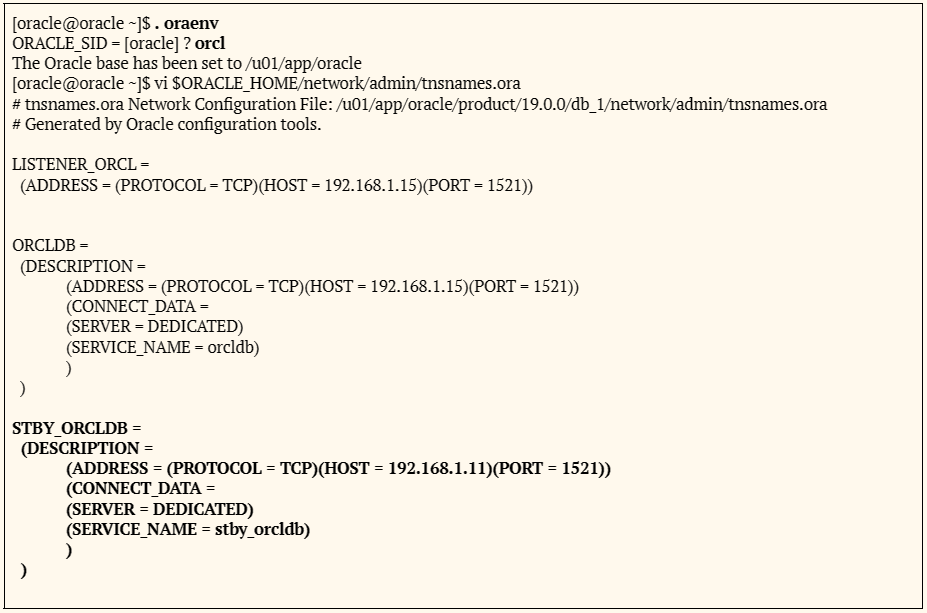
* Create $ORACLE_HOME/network/admin/tnsnames.ora file on the standby server
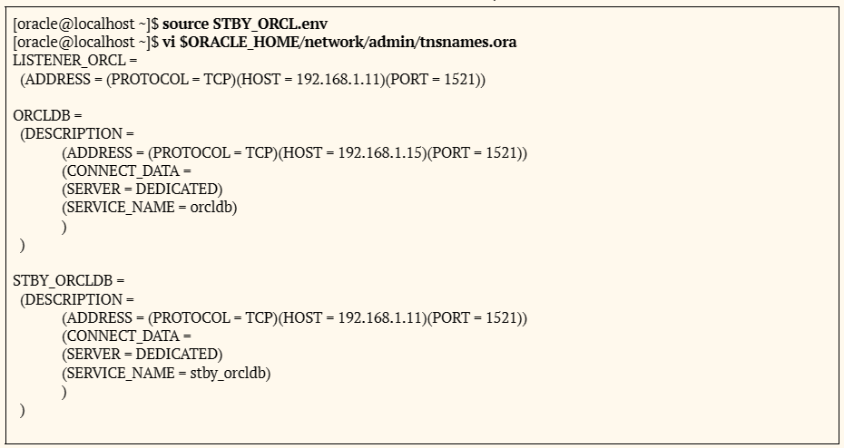
* Add SID_LIST_LISTENER block, required for Data Guard connection, to the LISTENER config file on the Primary side
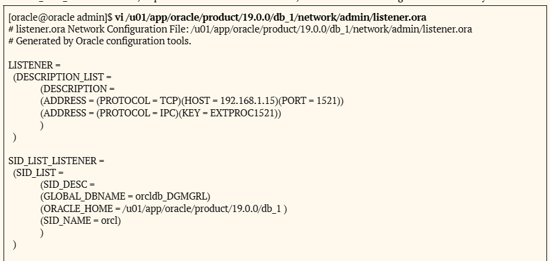
* Create a config file for the LISTENER on the standby side. You can copy the content from primary side and update HOST, GLOBAL_DBNAME, and SID_NAME values:
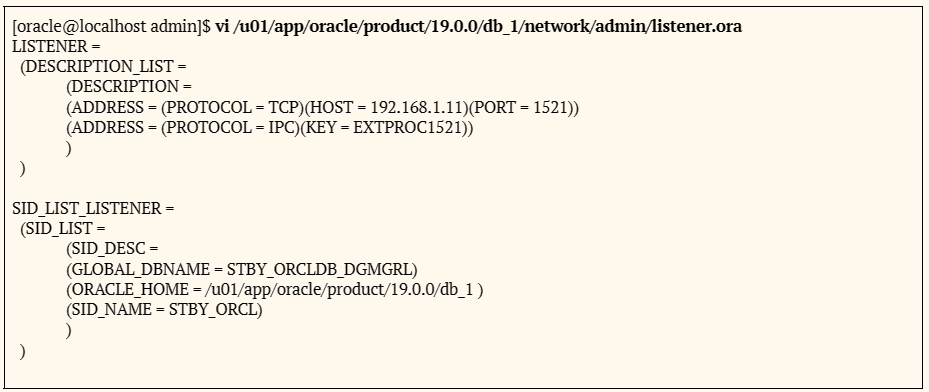
* Double check that listener processes are started on Primary and Standby. You can start it with the LSNRCTL START command.
* If you did everything right TNSPING command should return OK status for all service on Primary and Standby side.

## How to create Standby?
* Create a backup directory on Standby DB node, and copy backup files we created on Primary to this directory:
```bash
[root@localhost ~]# mkdir /backup
[root@localhost ~]# scp -r root@192.168.1.15:/backup/oracle /backup/
[root@localhost ~]# chown oracle:oinstall -R /backup
```

* Change user to oracle and copy backup of password files from Primary side and change the file name contain SID name standby. 

* Copy a text parameter file from Primary Database to the /home/oracle directory. And make necessary changes.
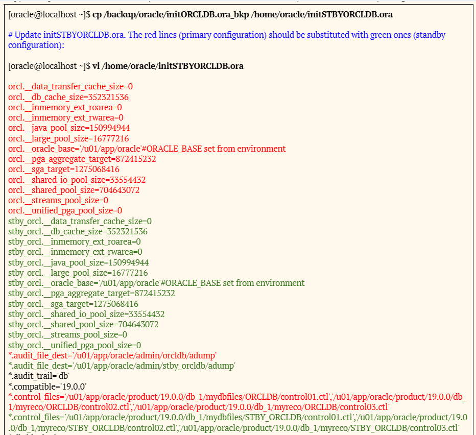
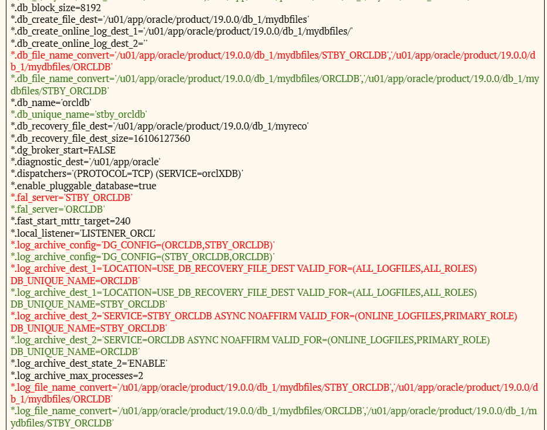
* Now we need to connect to IDLE stance. And startup in NO MOUNT mode from parameter file with we just prepared.
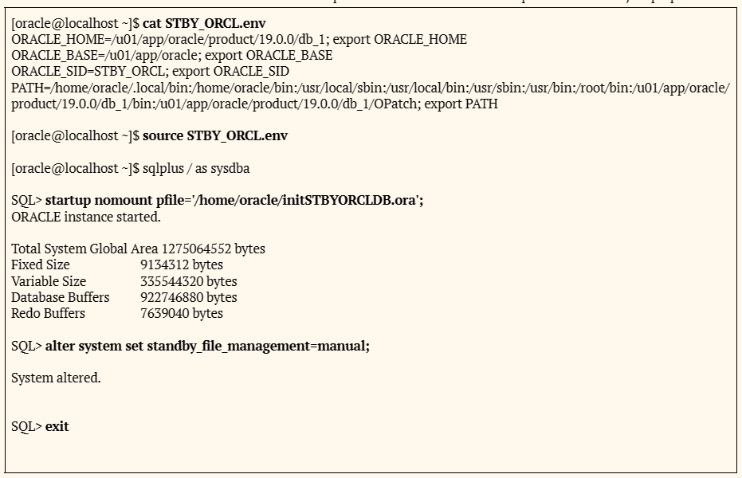

* Run the create SPFILE FROM PFILE statement to create the SPFILE in the default directory
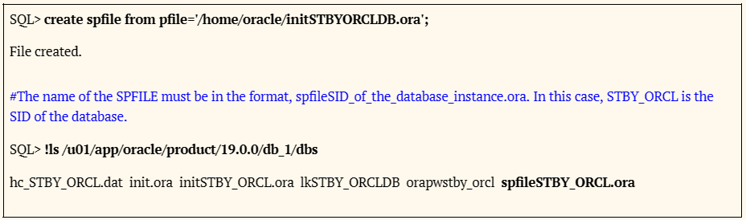
* Well done, if this working finely you can check with gap command and test insert or any CRUD method.
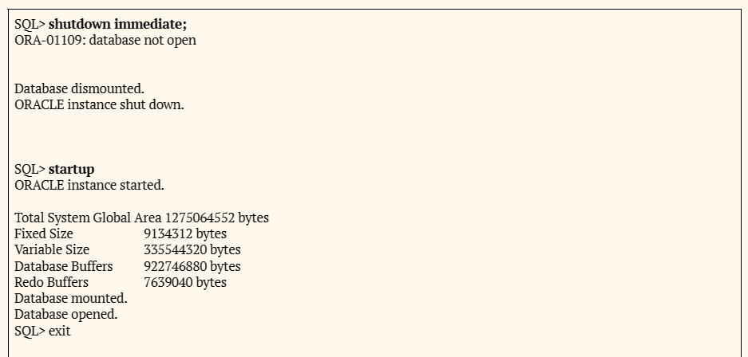


listener.ora PRIMARY
```bash
# listener.ora Network Configuration File: /u01/app/oracle/product/19.0.0/db_1/network/admin/listener.ora
# Generated by Oracle configuration tools.

LISTENER =
 (DESCRIPTION_LIST =
      (DESCRIPTION =
      (ADDRESS = (PROTOCOL = TCP)(HOST = 192.168.1.33)(PORT = 1521))
      (ADDRESS = (PROTOCOL = IPC)(KEY = EXTPROC1521))
      )
  )

SID_LIST_LISTENER =
 (SID_LIST = 
       (SID_DESC =
       (GLOBAL_DBNAME = ORCLDB)
       (ORACLE_HOME = /u01/app/oracle/product/19.0.0/db_1)
       (SID_NAME = orcl)
       )
 )
```

tnsnames.ora PRIMARY
```bash
LISTENER_ORCL =
 (ADDRESS = (PROTOCOL = TCP)(HOST = 192.168.1.33)(PORT = 1521))

ORCLDB = 
 (DESCRIPTION=
	(ADDRESS = (PROTOCOL = TCP)(HOST = 192.168.1.33)(PORT = 1521))
	(CONNECT_DATA = 
		(SERVER = DEDICATED)
		(SERVICE_NAME = orcldb)
	)
 )

STBY_ORCLDB = 
 (DESCRIPTION=
        (ADDRESS = (PROTOCOL = TCP)(HOST = 192.168.1.35)(PORT = 1521))
        (CONNECT_DATA =
       		 (SERVER = DEDICATED)
       		 (SERVICE_NAME = stby_orcldb)
        )
 )
```

listener.ora STBY
```bash
# listener.ora Network Configuration File: /u01/app/oracle/product/19.0.0/db_1/network/admin/listener.ora
# Generated by Oracle configuration tools.

LISTENER =
 (DESCRIPTION_LIST =
      (DESCRIPTION =
      (ADDRESS = (PROTOCOL = TCP)(HOST = 192.168.1.35)(PORT = 1521))
      (ADDRESS = (PROTOCOL = IPC)(KEY = EXTPROC1521))
      )
  )

SID_LIST_LISTENER =
 (SID_LIST =
       (SID_DESC =
       (GLOBAL_DBNAME = ORCLDB)
       (ORACLE_HOME = /u01/app/oracle/product/19.0.0/db_1)
       (SID_NAME = STBY_ORCL)
       )
 )
```

tnsnames.ora STBY
```bash
LISTENER_ORCL =
 (ADDRESS = (PROTOCOL = TCP)(HOST = 192.168.1.35)(PORT = 1521))

STBY_ORCLDB =
 (DESCRIPTION=
        (ADDRESS = (PROTOCOL = TCP)(HOST = 192.168.1.35)(PORT = 1521))
        (CONNECT_DATA =
                 (SERVER = DEDICATED)
                 (SERVICE_NAME = stby_orcldb)
        )
 )

ORCLDB =
 (DESCRIPTION=
        (ADDRESS = (PROTOCOL = TCP)(HOST = 192.168.1.33)(PORT = 1521))
        (CONNECT_DATA =
                (SERVER = DEDICATED)
                (SERVICE_NAME = orcldb)
        )
 )

```

cat STBY_ORCL.env
```bash
ORACLE_HOME=/u01/app/oracle/product/19.0.0/db_1; export ORACLE_HOME
ORACLE_BASE=/u01/app/oracle; export ORACLE_BASE
ORACLE_SID=STBY_ORCLDB; export ORACLE_SID
PATH=/home/oracle/.local/bin:/home/oracle/bin:/usr/local/sbin:/usr/local/bin:/usr/sbin:/usr/bin:/root/bin:$ORACLE_HOME/bin:$ORACLE_HOME/OPatch; export PATH
```

## Another Refrence For Solved
https://logic.edchen.org/how-to-resolve-ora-01152-file-1-was-not-restored-from-a-sufficiently-old-backup/


