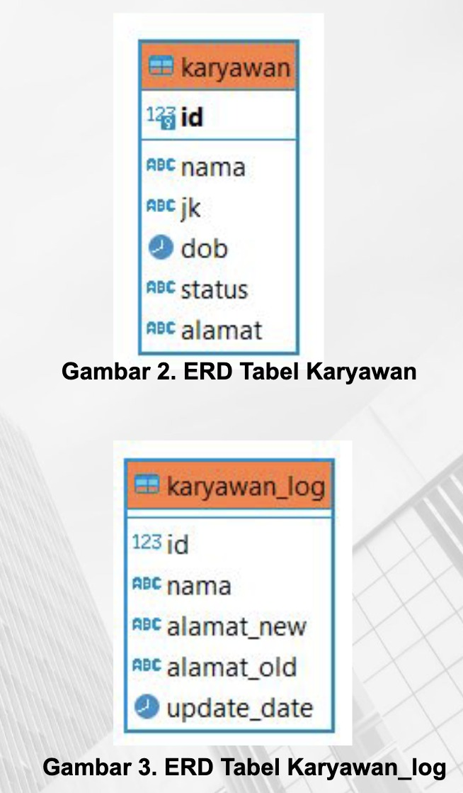

# Case Study: Problem Statement
Kalbe Nutritionals adalah salah satu perusahan terbesar di indonesia. Untuk menunjang kemampuan karyawan mereka, maka Kalbe Nutritionals ingin memberikan training kepada semua karyawan mereka berbasis online.

Oleh karena itu anda diminta untuk membuat aplikasi Training karyawan untuk Kalbe Nutritionals tersebut. Pada Sprint ini, kamu hanya diberikan task pada tabel Karyawan. Diketahui ERD Karyawan seperti berikut.

“Oleh karena itu, anda diminta untuk mencatat log dengan membuat trigger terhadap table karyawan pada kolumn alamat untuk dapat melihat alamat lama dikemudian hari.”

Jika diketahui table karyawan_log seperti berikut : 



## Solusi
1. Membuat table karyawan_log
```bash
CREATE TABLE public.karyawan (
    id serial4 PRIMARY KEY NOT NULL,
    nama varchar(100) NOT NULL,
    jk varchar(20) NOT NULL,
    dob date,
    status varchar(20) NOT NULL,
    alamat text
);
```
```bash
CREATE TABLE public.karyawan_log (
    id serial PRIMARY KEY,
    karyawan_id int NOT NULL,
    nama varchar(100) NOT NULL,
    alamat_new text,
    alamat_old text,
    update_date timestamp
);
```

2. Membuat fungsi log_alamat_update_karyawan
Fungsi ini berisi query untuk insert ke table karyawan_log dimana datanya diambil dari karyawan. Untuk menyimpan alamat_old Ketika karyawan update data alamat.
```bash
CREATE OR REPLACE FUNCTION public.log_alamat_update_karyawan()
RETURNS trigger
LANGUAGE plpgsql
AS $function$
BEGIN
    IF NEW.alamat <> OLD.alamat THEN
        INSERT INTO karyawan_log (id, nama, alamat_new, alamat_old, update_date)
        VALUES (OLD.id, OLD.nama, NEW.alamat, OLD.alamat, now());
    END IF;
    RETURN NEW;
END;
$function$;
```

3. Membuat Trigger Before Update
```bash
create trigger alamat_update_karyawan
	before update 
	on karyawan
	for each row 
	execute procedure log_alamat_update_karyawan();
```
- Ini adalah sintak untuk membuat Trigger.
- Trigger ini dijalankan ketika data dalam tabel di-update: ditandai dengan BEFORE UPDATE
- Nama trigger : alamat_update_karyawan
- Tabel dituju:karyawan
- Prosedure yang dituju: log_alamat_update_karyawan

4. Testing 
```bash
update karyawan set alamat= 'jakarta utara' where id =1;
```
