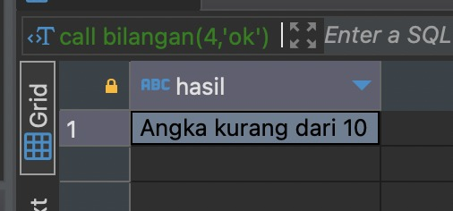
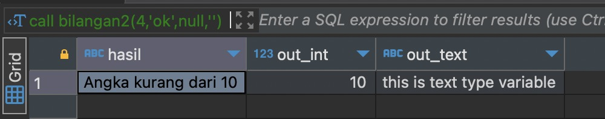
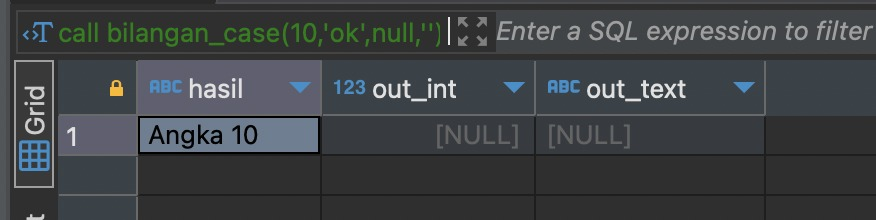
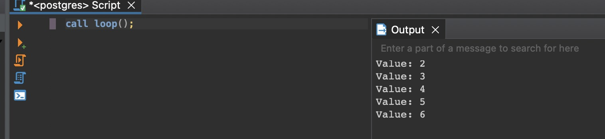

# Contoh Dari Penggunaan Stored Procedure

## Print to Console

```bash
raise notice 'Value: %', nama_variabel;
```

## Not Exist or Exist

```bash
CREATE OR REPLACE PROCEDURE public.cek_id(resid integer)
LANGUAGE plpgsql
AS $procedure$
BEGIN
    IF NOT EXISTS (SELECT id FROM barang b WHERE id = resid) THEN
        RAISE NOTICE 'ID tidak ada';
        RETURN;
    ELSE
        RAISE NOTICE 'ID ada';
    END IF;
END;
$procedure$;
```

## Percabangan
IF-ELSEIF-ELSE digunakan untuk memberikan beberapa kondisi dalam
pengambilan keputusan.

```bash
CREATE OR REPLACE PROCEDURE public.bilangan(IN input INT, OUT hasil VARCHAR(20))
LANGUAGE plpgsql
AS $procedure$
BEGIN
    IF input > 15 THEN
        hasil := 'Angka lebih dari 15';
    ELSIF input > 10 THEN
        hasil := 'Angka lebih dari 10';
    ELSE
        hasil := 'Angka kurang dari 10';
    END IF;
END;
$procedure$;
```

```bash
call bilangan(4,'ok');
```


## Variable

```bash
CREATE OR REPLACE PROCEDURE public.bilangan2(IN input integer, OUT hasil character varying, OUT out_int integer, OUT out_text text)
LANGUAGE plpgsql
AS $procedure$
DECLARE
    var1_int INTEGER := 10;
    var2_text TEXT := 'this is text type variable';
    var3_date DATE := now();
BEGIN
    IF input > 15 THEN
        hasil = 'Angka lebih dari 15';
        out_int = var1_int;
        out_text = var2_text;
    ELSIF input > 10 THEN
        hasil = 'Angka lebih dari 10';
        out_int = var1_int;
        out_text = var2_text;
    ELSE
        hasil = 'Angka kurang dari 10';
        out_int = var1_int;
        out_text = var2_text;
    END IF;
END;
$procedure$;
```

```bash
call bilangan2(4,'ok',null,'');
```



## Case
Case adalah bentuk percabangan case sederhana yang dapat memeriksa serangkaian kondisi yang memiliki nilai unik.

```bash
CREATE OR REPLACE PROCEDURE public.bilangan_case(IN input integer, OUT hasil character varying, OUT out_int integer, OUT out_text text)
LANGUAGE plpgsql
AS $procedure$
DECLARE
    var1_int INTEGER := 10;
    var2_text TEXT := 'this is text type variable';
    var3_date DATE := now();
BEGIN
    CASE
        WHEN input = 10 THEN
            hasil := 'Angka 10';
        WHEN input = 20 THEN
            hasil := 'Angka 20';
        WHEN input = 30 THEN
            hasil := 'Angka 30';
        ELSE
            hasil := 'Bukan angka 10, 20, atau 30';
    END CASE;
END;
$procedure$;
```

```bash
call bilangan_case(10,'ok',null,'');
```



## Loop

```bash
CREATE OR REPLACE PROCEDURE public.loop()
LANGUAGE plpgsql
AS $procedure$
DECLARE
    a INT := 1;
BEGIN
    LOOP
        a := a + 1;
        RAISE NOTICE 'Value: %', a;
        EXIT WHEN a > 5;
    END LOOP;
END;
$procedure$;
```

```bash
call loop();
```




## Function
- Return table : return Query

```bash
CREATE TABLE public.barang (
    id serial PRIMARY KEY,
    harga float8,
    nama varchar(45),
    satuan varchar(45),
    stok int4 NOT NULL,
    deleted_date timestamp,
    created_date timestamp,
    updated_date timestamp
);
```
```bash
CREATE OR REPLACE FUNCTION public.getbarang(rqnama character varying)
RETURNS TABLE (resid bigint, resnama character varying, resstok integer, resharga double precision, ressatuan character varying)
LANGUAGE plpgsql
AS $function$
BEGIN
    RETURN QUERY
    SELECT
        id,
        nama,
        stok,
        harga,
        satuan
    FROM barang
    WHERE nama ILIKE rqnama;
END;
$function$;
```
```bash
select * from getbarang(‘%barang%’);
```

- Return table with For LOOP

```bash
CREATE OR REPLACE FUNCTION public.getbarang1(rqnama character varying)
RETURNS TABLE (resid integer, resnama character varying, resstok character varying, resharga integer, ressatuan character varying)
LANGUAGE plpgsql
AS $function$
BEGIN
    RETURN QUERY
    SELECT
        id,
        nama,
        stok,
        harga,
        satuan
    FROM barang
    WHERE nama ILIKE rqnama;
END;
$function$;
```

```bash
select * from getbarang1('%barang%');
```

- Return By ID

```bash
CREATE OR REPLACE FUNCTION public.getbyidfunction(rqid integer)
RETURNS TABLE (resid bigint, resnama character varying, ressatuan character varying, resstok integer, resharga double precision)
LANGUAGE plpgsql
AS $function$
BEGIN
    RETURN QUERY
    SELECT
        e.id,
        e.nama,
        e.satuan,
        e.stok,
        e.harga
    FROM public.barang AS e
    WHERE e.id = rqid;
END;
$function$;
```

```bash
select * from getbyidfunction(22);
```

- Select + Case + COALESCE + For Loop

```bash
CREATE OR REPLACE FUNCTION public.getbarang2(rqnama character varying)
RETURNS TABLE(resid integer, resnama character varying, resstok character varying, resharga integer, ressatuan character varying)
LANGUAGE plpgsql
AS $function$
DECLARE
    var_r record;
BEGIN
    FOR var_r IN (
        SELECT
            id,
            CASE nama
                WHEN 'barang 10' THEN 'result barang 10'
                WHEN 'barang 11' THEN 'result barang 11'
                ELSE nama
            END,
            stok,
            COALESCE(harga, 0) as harga,
            satuan
        FROM barang
        WHERE nama ILIKE rqnama
    )
    LOOP
        resid := var_r.id ;
        resnama := var_r.nama ;
        resstok := var_r.stok ;
        resharga := var_r.harga ;
        ressatuan := var_r.satuan ;
        RETURN NEXT;
    END LOOP;
END;
$function$;
```

```bash
select * from getbarang2('%barang%');
```


