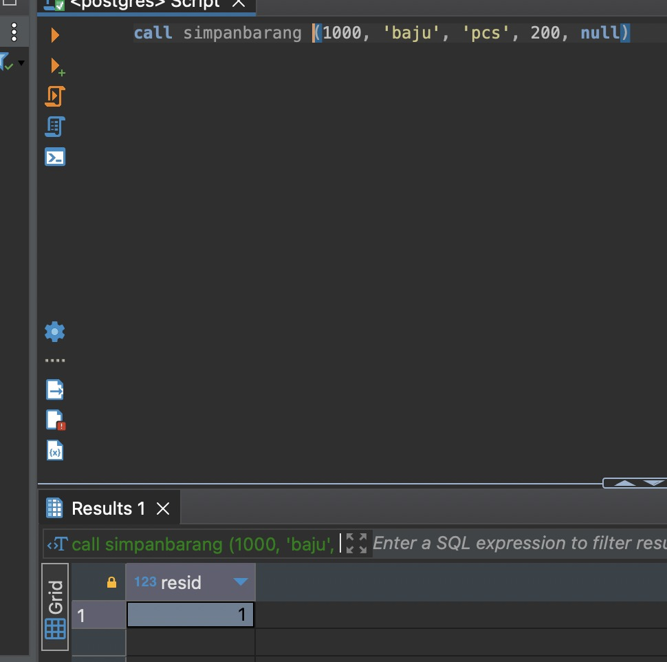
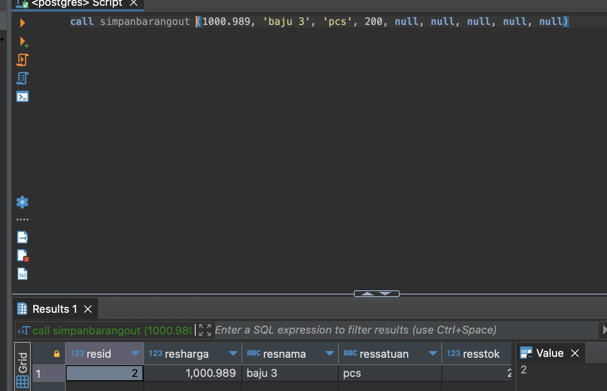
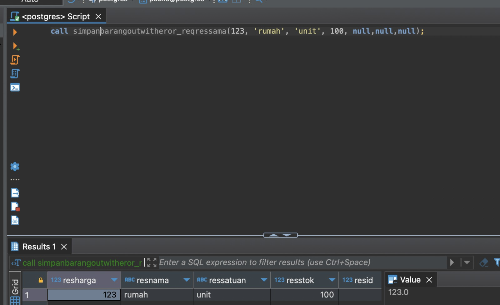

# Praktek Store Procedure and Function

Studi kasus table barang; CRUD

## 1. Insert
- Contoh 1 
```bash
CREATE OR REPLACE PROCEDURE public.simpanbarang(
    IN rqharga float,
    IN rqnama character varying,
    IN rqsatuan character varying,
    IN rqstok integer,
    INOUT resid integer
)
LANGUAGE plpgsql
AS $procedure$
BEGIN
    INSERT INTO public.barang
    (id, harga, nama, satuan, stok, created_date, updated_date)
    VALUES (
        nextval('barang_id_seq'),
        rqharga,
        rqnama,
        rqsatuan,
        rqstok,
        NOW(),
        NOW()
    )
    RETURNING id INTO resid;
    
    COMMIT;
END;
$procedure$;
```


- Contoh 2
```bash
CREATE OR REPLACE PROCEDURE public.simpanbarangout(
    IN rqharga double precision,
    IN rqnama character varying,
    IN rqsatuan character varying,
    IN rqstok integer,
    INOUT resid integer,
    OUT resharga double precision,
    OUT resnama character varying,
    OUT ressatuan character varying,
    OUT resstok integer
)
LANGUAGE plpgsql
AS $procedure$
BEGIN
    INSERT INTO public.barang
    (id, harga, nama, satuan, stok, created_date, updated_date)
    SELECT
        nextval('barang_id_seq'),
        rqharga,
        rqnama,
        rqsatuan,
        rqstok,
        NOW(),
        NOW()
    RETURNING id INTO resid;

    resharga := rqharga;
    resnama := rqnama;
    ressatuan := rqsatuan;
    resstok := rqstok;

    COMMIT;
END;
$procedure$;
```
```bash
call simpanbarangout(1000.989, 'baju 3', 'pcs', 200, null, null, null, null, null)
```


- Contoh 3 : Insert with out dan eror code
```bash
CREATE OR REPLACE PROCEDURE public.simpanbarangoutwitheror(
    IN rqharga double precision,
    IN rqnama character varying,
    IN rqsatuan character varying,
    IN rqstok integer,
    INOUT resid integer,
    INOUT resharga double precision,
    INOUT resnama character varying,
    INOUT ressatuan character varying,
    INOUT resstok integer,
    INOUT reserordesc character varying,
    INOUT reserorcode integer
)
LANGUAGE plpgsql
AS $procedure$
BEGIN
    IF rqnama IS NULL THEN
        RAISE NOTICE 'nama kosong';
        reserordesc := 'nama wajib diisi';
        reserorcode := 404;
        RETURN;
    ELSE
        RAISE NOTICE 'nama ada';
    END IF;
    
    INSERT INTO public.barang
    (id, harga, nama, satuan, stok, created_date, updated_date)
    SELECT
        nextval('barang_id_seq'),
        rqharga,
        rqnama,
        rqsatuan,
        rqstok,
        NOW(),
        NOW()
    RETURNING id INTO resid;

    resharga := rqharga;
    resnama := rqnama;
    ressatuan := rqsatuan;
    resstok := rqstok;
    reserordesc := 'sukses';
    reserorcode := 200;

    COMMIT;
END;
$procedure$;
```
```bash
call simpanbarangoutwitheror(123, null, 'unit', 100, null,null,null,null,null,null,null);
```
```bash
select * from barang b where id = 9;
```

```bash
CREATE OR REPLACE PROCEDURE public.simpanbarangoutwitheror_reqressama(
    INOUT resharga double precision,
    INOUT resnama character varying,
    INOUT ressatuan character varying,
    INOUT resstok integer,
    INOUT resid integer,
    INOUT reserordesc character varying,
    INOUT reserorcode integer
)
LANGUAGE plpgsql
AS $procedure$
BEGIN
    IF resnama IS NULL THEN
        RAISE NOTICE 'nama kosong';
        reserordesc := 'nama wajib diisi';
        reserorcode := 404;
        RETURN;
    ELSE
        RAISE NOTICE 'nama ada';
    END IF;
    
    INSERT INTO public.barang
    (id, harga, nama, satuan, stok, created_date, updated_date)
    SELECT
        nextval('barang_id_seq'),
        resharga,
        resnama,
        ressatuan,
        resstok,
        NOW(),
        NOW()
    RETURNING id INTO resid;
    
    reserordesc := 'sukses';
    reserorcode := 200;
    
    COMMIT;
END;
$procedure$;
```
```bash
call simpanbarangoutwitheror_reqressama(123, 'rumah', 'unit', 100, null,null,null);
```



## Update
- Contoh 1
```bash
CREATE OR REPLACE PROCEDURE public.update_barang(
    rqharga integer,
    rqnama character varying,
    rqsatuan character varying,
    rqstok integer,
    INOUT resid integer
)
LANGUAGE plpgsql
AS $procedure$
BEGIN
    UPDATE public.barang
    SET
        harga = rqharga,
        nama = rqnama,
        satuan = rqsatuan,
        stok = rqstok
    WHERE id = resid
    RETURNING id INTO resid;
    
    COMMIT;
END;
$procedure$;
```
```bash
call update_barang(3000, 'buku', 'lusin', 300, 22)
```

- Contoh 2
```bash
CREATE OR REPLACE PROCEDURE public.updatebarangout(
    IN rqharga integer,
    IN rqnama character varying,
    IN rqsatuan character varying,
    IN rqstok integer,
    INOUT resid integer,
    INOUT resharga double precision,
    INOUT resnama character varying,
    INOUT ressatuan character varying,
    INOUT resstok integer
)
LANGUAGE plpgsql
AS $procedure$
BEGIN
    UPDATE public.barang
    SET
        harga = rqharga,
        nama = rqnama,
        satuan = rqsatuan,
        stok = rqstok
    WHERE id = resid
    RETURNING id INTO resid;
    
    resharga := rqharga;
    resnama := rqnama;
    ressatuan := rqsatuan;
    resstok := rqstok;
    
    COMMIT;
END;
$procedure$;
```
```bash
call updatebarangout(3000, 'buku update 1', 'lusin', 300, 22, null, '', '', null)
```

- Insert with out and error description
```bash
CREATE OR REPLACE PROCEDURE public.update_barangoutwitheror(
    IN rqharga integer,
    IN rqnama character varying,
    IN rqsatuan character varying,
    IN rqstok integer,
    INOUT resid integer,
    INOUT resharga double precision,
    INOUT resnama character varying,
    INOUT ressatuan character varying,
    INOUT resstok integer,
    INOUT reserordesc character varying,
    INOUT reserorcode integer
)
LANGUAGE plpgsql
AS $procedure$
BEGIN
    -- Cek apakah id yang akan diupdate ada dalam tabel barang
    PERFORM id FROM barang WHERE id = resid;
    
    IF NOT FOUND THEN
        raise notice 'id tidak ada';
        reserordesc := 'id tidak ditemukan';
        reserorcode := 404;
        return;
    ELSE
        raise notice 'id ada';
    END IF;

    -- Lakukan update
    UPDATE public.barang
    SET
        harga = rqharga,
        nama = rqnama,
        satuan = rqsatuan,
        stok = rqstok
    WHERE id = resid
    RETURNING id INTO resid;
    
    -- Set nilai-nilai keluaran
    resharga := rqharga;
    resnama := rqnama;
    ressatuan := rqsatuan;
    resstok := rqstok;
    reserordesc := 'sukses';
    reserorcode := 200;
    
    -- Commit perubahan
    COMMIT;
END;
$procedure$;
```
```bash
call updatebarangoutwitheror(3000, 'buku update 1', 'lusin', 300, 2222, null, '', '', null,'',null);
```

## Get List
```bash
CREATE OR REPLACE FUNCTION public.getbarang1(rqnama character varying)
RETURNS TABLE(resid integer, resnama character varying, resstok character varying,
resharga integer, ressatuan character varying)
LANGUAGE plpgsql
AS $function$
DECLARE
    var_r record;
BEGIN
    FOR var_r IN SELECT
        id,
        nama,
        stok,
        harga,
        satuan
        FROM barang
        WHERE nama ILIKE rqnama  -- Menggunakan rqnama, bukan rqNama
    LOOP
        resid := var_r.id;
        resnama := var_r.nama;
        resstok := var_r.stok;
        resharga := var_r.harga;
        ressatuan := var_r.satuan;
        RETURN NEXT;
    END LOOP;
END;
$function$;
```
```bash
select * from getbarang1('%barang%')
```

## Get By Id
```bash
CREATE OR REPLACE FUNCTION public.getbyidfunction(rqid integer)
RETURNS TABLE(resid bigint, resnama character varying, ressatuan character varying, resstok integer, resharga double precision)
LANGUAGE plpgsql
AS $function$
BEGIN
    RETURN QUERY
    SELECT e.id, e.nama, e.satuan, e.stok, e.harga
    FROM public.barang AS e
    WHERE e.id = rqid; -- Menggunakan rqid, bukan rqId
END;
$function$;
```
```bash
select * from getbyidfunction(22)
```

## Delete

```bash
CREATE OR REPLACE PROCEDURE public.deletebarang(rqid integer)
LANGUAGE plpgsql
AS $procedure$
BEGIN
    DELETE FROM barang WHERE id = rqid;
    COMMIT;
END;
$procedure$;
```


